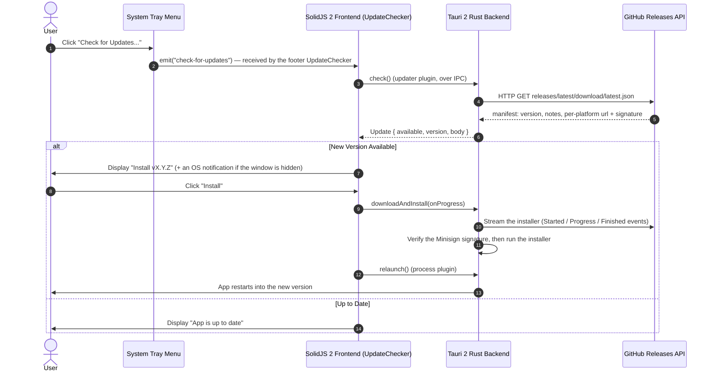

# Minimalistic App Auto-Update System 🚀

This document details the **GitHub Releases Auto-Update System** implemented in this template, taking direct architectural and technical inspiration from the [**Handy**](https://github.com/cjpais/Handy) application.

---

## 📌 Architecture Overview

The auto-update workflow allows published releases on GitHub to be detected, downloaded, cryptographically verified, installed, and launched automatically without manual user intervention.



---

## 🛠️ Key Components & Responsibilities

### 1. Tauri 2 Config (`src-tauri/tauri.conf.json`)

The updater plugin is configured under `bundle` and `plugins.updater`:

```json
{
  "bundle": {
    "createUpdaterArtifacts": true
  },
  "plugins": {
    "updater": {
      "pubkey": "YOUR_MINISIGN_PUBLIC_KEY_HERE",
      "endpoints": [
        "https://github.com/your-username/minimalistic-app/releases/latest/download/latest.json"
      ]
    }
  }
}
```

- **`createUpdaterArtifacts: true`**: Instructs `bun run tauri build` to automatically sign generated installers (`.nsis`, `.msi`, `.dmg`, `.AppImage`) and output a matching `latest.json` file.
- **`endpoints`**: Specifies the direct download URL for `latest.json` on GitHub Releases.
- **`pubkey`**: ⚠️ The template ships a **placeholder** key. Replace it with your own Minisign public key (see [Cryptographic Code Signing](#-cryptographic-code-signing-minisign)) — otherwise signature verification will fail against your signed artifacts.

### 2. Rust Backend Integration (`src-tauri/src/lib.rs`)

1. **Plugin Initialization** (in the builder chain):

   ```rust
   .plugin(tauri_plugin_process::init())
   .plugin(tauri_plugin_updater::Builder::new().build())
   ```

2. **System Tray Integration**:
   A context menu item `"check_updates"` is registered on the tray icon. Clicking it surfaces the window **only if hidden** and emits `"check-for-updates"` to SolidJS 2:

   ```rust
   "check_updates" => {
       show_window_if_hidden(app);
       let _ = app.emit("check-for-updates", ());
   }
   ```

3. **Capabilities** (`src-tauri/capabilities/default.json`): the webview needs the `updater:default` and `process:default` permissions (both already granted in the template) to call `check()` / `downloadAndInstall()` / `relaunch()`.

### 3. SolidJS 2 Frontend Component (`src/components/UpdateChecker.tsx`)

Inspired by Handy's `UpdateChecker` design:

- **`check()`**: Queries the configured `latest.json` endpoint to compare version strings.
- **`downloadAndInstall(onProgress)`**: Streams binary download chunks, emitting `Started`, `Progress`, and `Finished` events to calculate dynamic download percentages.
- **`relaunch()`**: Automatically terminates the running app process and launches the newly updated application binary.
- **Dual-variant rule**: the card instance (Preferences tab) auto-checks on mount, gated on the saved "check for updates on launch" preference, and unmounts with its tab; the footer instance is mounted for the whole session and is the one that listens for the tray's `check-for-updates` event. Each instance does exactly one of the two jobs, so no check is ever issued twice — see CRUSH.md pattern 3 for why the two jobs need two lifetimes.
- **Hidden-window notification**: a version found while the window is in the tray is announced through a native OS notification (`src/lib/notification.ts`); the webview holds the `notification:default` capability for that.

---

## 🔐 Cryptographic Code Signing (Minisign)

Tauri 2 requires update payloads to be signed using Minisign key pairs to prevent binary tampering.

### Generating Keys

Run the following command in your terminal using Bun:

```bash
bun tauri signer generate
```

This command produces:

1. **Public Key**: Placed inside `tauri.conf.json` under `plugins.updater.pubkey`.
2. **Private Key**: Stored securely as an environment variable (`TAURI_SIGNING_PRIVATE_KEY`) in GitHub Repository Secrets.

---

## 📄 `latest.json` Feed Schema

When a release build completes, Tauri generates a `latest.json` metadata feed formatted like this:

```json
{
  "version": "0.9.0",
  "notes": "Feature updates and stability improvements.",
  "pub_date": "2026-08-01T18:00:00Z",
  "platforms": {
    "windows-x86_64": {
      "signature": "dW50cnVzdGVkIGNvbW1lbnQ6IG1pbmlzaWduIHNpZ25hdHVyZQ...",
      "url": "https://github.com/your-username/minimalistic-app/releases/download/v0.9.0/minimalistic-app_0.9.0_x64-setup.exe"
    },
    "darwin-aarch64": {
      "signature": "dW50cnVzdGVkIGNvbW1lbnQ6IG1pbmlzaWduIHNpZ25hdHVyZQ...",
      "url": "https://github.com/your-username/minimalistic-app/releases/download/v0.9.0/minimalistic-app_0.9.0_aarch64.app.tar.gz"
    }
  }
}
```

The `url` fields point at the exact installers uploaded to the GitHub Release; `signature` is the Minisign signature of each binary. The updater plugin verifies every download against these before installing.

---

## 🤖 Continuous Integration & GitHub Actions Workflow

The release pipeline is committed as [`.github/workflows/release.yml`](.github/workflows/release.yml)
and runs on every `v*` tag push, or manually through `workflow_dispatch` with an
optional `tag` input. It is two jobs:

1. **`create-release`** (Ubuntu) reads the version from `package.json`, extracts
   that version's section from `CHANGELOG.md` as the release notes, and creates a
   **draft** GitHub release for the tag.
2. **`build-and-upload`** (matrix: Windows x86_64, macOS Apple Silicon, macOS
   Intel, Linux `.deb` + `.AppImage`) runs `bun install --frozen-lockfile` and then
   [`tauri-apps/tauri-action`](https://github.com/tauri-apps/tauri-action), which
   builds the bundles (`beforeBuildCommand` in `tauri.conf.json` runs the Vite
   build), signs the updater artifacts with `TAURI_SIGNING_PRIVATE_KEY` /
   `TAURI_SIGNING_PRIVATE_KEY_PASSWORD`, and uploads them together with
   `latest.json` to the draft release.

Publishing the draft is the one manual step: review the notes and the artifacts,
then press **Publish release**. Only then does
`releases/latest/download/latest.json` — the updater endpoint — resolve to the new
version, which is what makes a draft a safe place for a broken build to land.

When you fork this template, the two things to change are the signing secrets
(steps below) and the release title, which `bun run rename-project` rewrites for
you.

> [!TIP]
> The tag comes from the push (or the `workflow_dispatch` input) and the version
> from `package.json`; keep the version mirrors in sync
> (`bun run before-commit --check`) so the tag matches the app version.

---

## 🚀 Your First Release — Step-by-Step

1. **Update GitHub Repository Links**:
   Replace `your-username/minimalistic-app` in `src-tauri/tauri.conf.json` (updater `endpoints`) with your real GitHub owner and repository name.
2. **Generate Minisign Keys**:
   Execute `bun tauri signer generate` and paste the **public key** into `tauri.conf.json` under `plugins.updater.pubkey`.
3. **Set Repository Secrets**:
   Add `TAURI_SIGNING_PRIVATE_KEY` and `TAURI_SIGNING_PRIVATE_KEY_PASSWORD` to your GitHub Repository Secrets (`Settings > Secrets & Variables > Actions`).
4. **Configure the Release Workflow**:
   The committed `.github/workflows/release.yml` triggers on `v*` tag pushes (or manually via `workflow_dispatch`). Add your signing secrets (`TAURI_SIGNING_PRIVATE_KEY`, `TAURI_SIGNING_PRIVATE_KEY_PASSWORD`) to **Settings → Secrets & Variables → Actions** and point `endpoints`/`pubkey` at your repo.
5. **Bump & Validate** (exact order — see `AGENTS.md`):
   ```bash
   bun run before-commit --bump <major|minor|patch>
   bun run before-commit --check
   bun run typecheck
   ```
6. **Publish the Release**:
   Push a version tag matching `tauri.conf.json` (e.g. `git tag v0.9.0 && git push origin v0.9.0`) to trigger the GitHub Actions release pipeline.
7. **Verify the Feed**:
   After the workflow finishes, open `https://github.com/<owner>/<repo>/releases/latest/download/latest.json` in a browser — it should return the versioned JSON above. Then click "Check for Updates..." in the running app.

---

## 🧰 Troubleshooting

| Symptom                                                        | Cause & Fix                                                                                                                                                                                                                                                                                                         |
| :------------------------------------------------------------- | :------------------------------------------------------------------------------------------------------------------------------------------------------------------------------------------------------------------------------------------------------------------------------------------------------------------ |
| **"Update endpoint not found (GitHub release pending)"**       | No release exists yet, or `endpoints` still points at `your-username/minimalistic-app`. Publish a `v*` tag via the release workflow, then retry.                                                                                                                                                                    |
| **"Unable to connect to update server"**                       | Network offline, GitHub unreachable, or the repo is private (releases must be public for anonymous downloads).                                                                                                                                                                                                      |
| **Signature verification fails**                               | `plugins.updater.pubkey` does not match the private key used to sign the artifacts. Regenerate keys and re-publish — keys are one-way matched.                                                                                                                                                                      |
| **`latest.json` 404s after a successful release**              | The workflow produced it but `createUpdaterArtifacts: true` is missing, or the artifact names don't match the URL patterns in the feed. Check the workflow run logs for the `latest.json` upload step.                                                                                                              |
| **Release job fails with missing `TAURI_SIGNING_PRIVATE_KEY`** | The repository secrets were not set (Step 3). Without them `tauri-action` cannot sign artifacts.                                                                                                                                                                                                                    |
| **Update downloads but relaunch does nothing**                 | The `process:default` capability is missing — check `src-tauri/capabilities/default.json`.                                                                                                                                                                                                                          |
| **App updates during dev but not in release build**            | `bun run tauri dev` uses the dev URL; update checks are fully functional in dev, but ensure the installed release build (not the dev binary) is the one checking.                                                                                                                                                   |
| **"Does the CSP need a GitHub origin?"**                       | No. The updater's HTTPS traffic runs in the **Rust process**, where the webview CSP does not apply, so `connect-src` lists no GitHub origin and never needs one. A failing check is an endpoint-URL or network problem, not a CSP one. (An earlier revision granted both origins for nothing; 0.22.0 removed them.) |
