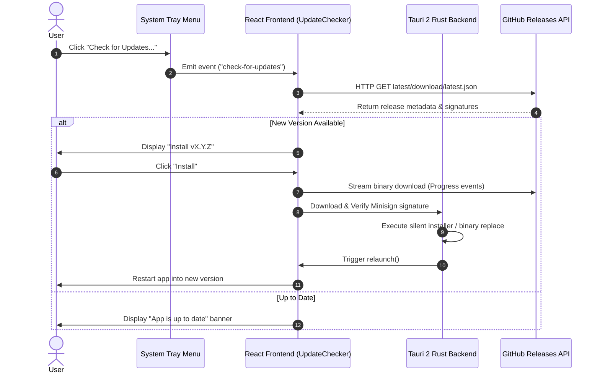

# Minimalistic App Auto-Update System 🚀

This document details the **GitHub Releases Auto-Update System** implemented in this template, taking direct architectural and technical inspiration from the [**Handy**](https://github.com/cjpais/Handy) application.

---

## 📌 Architecture Overview

The auto-update workflow allows published releases on GitHub to be detected, downloaded, cryptographically verified, installed, and launched automatically without manual user intervention.



---

## 🛠️ Key Components & Responsibilities

### 1. Tauri 2 Config (`src-tauri/tauri.conf.json`)
The updater plugin is configured under `bundle` and `plugins.updater`:

```json
{
  "bundle": {
    "createUpdaterArtifacts": true
  },
  "plugins": {
    "updater": {
      "pubkey": "YOUR_MINISIGN_PUBLIC_KEY_HERE",
      "endpoints": [
        "https://github.com/your-username/minimalistic-app/releases/latest/download/latest.json"
      ]
    }
  }
}
```

- **`createUpdaterArtifacts: true`**: Instructs `bun run tauri build` to automatically sign generated installers (`.nsis`, `.msi`, `.dmg`, `.AppImage`) and output a matching `latest.json` file.
- **`endpoints`**: Specifies the direct download URL for `latest.json` on GitHub Releases.

---

### 2. Rust Backend Integration (`src-tauri/src/lib.rs`)

1. **Plugin Initialization**:
   ```rust
   .plugin(tauri_plugin_process::init())
   .plugin(tauri_plugin_updater::Builder::new().build())
   ```

2. **System Tray Integration**:
   A context menu item `"check_updates"` is registered on the tray icon. Clicking it restores the main window and emits `"check-for-updates"` to React:
   ```rust
   "check_updates" => {
       if let Some(window) = app.get_webview_window("main") {
           if !window.is_visible().unwrap_or(false) {
               let _ = window.show();
               let _ = window.unminimize();
               let _ = window.set_focus();
           }
       }
       let _ = app.emit("check-for-updates", ());
   }
   ```

---

### 3. React Frontend Component (`src/components/UpdateChecker.tsx`)

Inspired by Handy's `UpdateChecker` design:
- **`check()`**: Queries the configured `latest.json` endpoint to compare version strings.
- **`downloadAndInstall(onProgress)`**: Streams binary download chunks, emitting `Started`, `Progress`, and `Finished` events to calculate dynamic download percentages.
- **`relaunch()`**: Automatically terminates the running app process and launches the newly updated application binary.

---

## 🔐 Cryptographic Code Signing (Minisign)

Tauri 2 requires update payloads to be signed using Minisign key pairs to prevent binary tampering.

### Generating Keys
Run the following command in your terminal using Bun:
```bash
bun tauri signer generate
```

This command produces:
1. **Public Key**: Placed inside `tauri.conf.json` under `plugins.updater.pubkey`.
2. **Private Key**: Stored securely as an environment variable (`TAURI_SIGNING_PRIVATE_KEY`) in GitHub Repository Secrets.

---

## 📄 `latest.json` Feed Schema

When a release build completes, Tauri generates a `latest.json` metadata feed formatted like this:

```json
{
  "version": "0.2.0",
  "notes": "Feature updates and stability improvements.",
  "pub_date": "2026-07-30T18:00:00Z",
  "platforms": {
    "windows-x86_64": {
      "signature": "dW50cnVzdGVkIGNvbW1lbnQ6IG1pbmlzaWduIHNpZ25hdHVyZQ...",
      "url": "https://github.com/your-username/minimalistic-app/releases/download/v0.2.0/minimalistic-app_0.2.0_x64-setup.exe"
    },
    "darwin-aarch64": {
      "signature": "dW50cnVzdGVkIGNvbW1lbnQ6IG1pbmlzaWduIHNpZ25hdHVyZQ...",
      "url": "https://github.com/your-username/minimalistic-app/releases/download/v0.2.0/minimalistic-app_0.2.0_aarch64.app.tar.gz"
    }
  }
}
```

---

## 🤖 Continuous Integration & GitHub Actions Workflow

Below is a complete, production-ready `.github/workflows/release.yml` file to automate building signed installers and publishing updates to GitHub Releases:

```yaml
name: "Release Build & Auto-Update Dispatch"

on:
  push:
    tags:
      - 'v*'

jobs:
  publish-tauri:
    permissions:
      contents: write
    strategy:
      fail-fast: false
      matrix:
        include:
          - platform: 'windows-latest'
            args: ''
          - platform: 'macos-latest'
            args: ''
          - platform: 'ubuntu-22.04'
            args: ''

    runs-on: ${{ matrix.platform }}
    steps:
      - name: Checkout repository
        uses: actions/checkout@v4

      - name: Setup Bun
        uses: oven-sh/setup-bun@v2
        with:
          bun-version: latest

      - name: Setup Rust toolchain
        uses: dtolnay/rust-toolchain@stable

      - name: Install dependencies (Linux only)
        if: matrix.platform == 'ubuntu-22.04'
        run: |
          sudo apt-get update
          sudo apt-get install -y libgtk-3-dev libwebkit2gtk-4.1-dev libappindicator3-dev librsvg2-dev patchelf

      - name: Install Node/Bun dependencies
        run: bun install

      - name: Build and Publish Tauri Application
        uses: tauri-apps/tauri-action@v0.5
        env:
          GITHUB_TOKEN: ${{ secrets.GITHUB_TOKEN }}
          TAURI_SIGNING_PRIVATE_KEY: ${{ secrets.TAURI_SIGNING_PRIVATE_KEY }}
          TAURI_SIGNING_PRIVATE_KEY_PASSWORD: ${{ secrets.TAURI_SIGNING_PRIVATE_KEY_PASSWORD }}
        with:
          tagName: v__VERSION__
          releaseName: 'Minimalistic App v__VERSION__'
          releaseBody: 'See release commit logs for details.'
          releaseDraft: false
          prerelease: false
          args: ${{ matrix.args }}
```

---

## 🚀 Setup Instructions for Template Users

When building a new app using this template:

1. **Update GitHub Repository Links**:
   Replace `your-username/minimalistic-app` in `src-tauri/tauri.conf.json` with your real GitHub owner and repository name.
2. **Generate Minisign Keys**:
   Execute `bun tauri signer generate` and paste the public key into `tauri.conf.json`.
3. **Set Repository Secrets**:
   Add `TAURI_SIGNING_PRIVATE_KEY` and `TAURI_SIGNING_PRIVATE_KEY_PASSWORD` to your GitHub Repository Secrets (`Settings > Secrets & Variables > Actions`).
4. **Publish Release**:
   Push a version tag (e.g. `git tag v0.1.1 && git push origin v0.1.1`) to trigger the GitHub Actions release pipeline!
