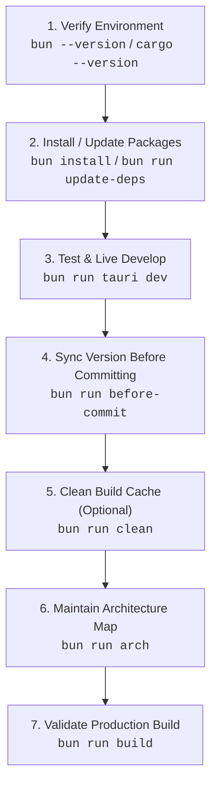

# Minimalistic App

The ultimate minimalistic, high-performance cross-platform desktop application template powered by **Tauri 2**, **Bun.js**, **SolidJS 2**, **TypeScript 7**, and **Cargo (Rust 2024 Edition)**.

Designed with a sleek **100% AMOLED Deep Black glassmorphic GUI (`#000000`)**, this application operates as a background utility residing in your operating system's taskbar / system tray with full left-click, right-click context menu interaction, and automated auto-updater support.

---

## ⚡ Primary Standard & Bun Rule

> [!CRITICAL]
> **1. Package Manager Rule**:
> NEVER use `npm`, `npx`, `yarn`, or `pnpm`. **ALWAYS use `bun`** for package management, script execution, and tooling.
>
> **2. Ultimate Testing Command**:
> The **ONLY** primary command to launch, test, and develop this application is:
>
> ```bash
> bun run tauri dev
> ```
>
> **3. Command Prefix Rule (Agent Operations)**:
> All shell commands — especially `git` — must be prefixed with `rtk` (e.g. `rtk git status`). RTK is always safe and is the sanctioned wrapper for every command in this repository. Exception: sanctioned Bun scripts (`bun run ...`) run directly without the `rtk` wrapper — see `AGENTS.md`.

---

## 📋 Standard Operating Procedure (SOP)

Follow this 7-step process when developing, modifying, or testing this repository:



### 1. Environment Verification

Verify that Bun and Cargo/Rust toolchains are installed:

```bash
bun --version
cargo --version
```

### 2. Dependency Management & Automatic @latest Upgrades

Install dependencies using Bun:

```bash
bun install
```

To run the automated **End-to-End Dual-Ecosystem & Sub-Dependency Upgrade Pipeline**:

```bash
bun run update-deps
```

_This 7-step pipeline force-upgrades all direct & transitive sub-dependencies across NPM and Crates.io to `@latest`, updates Cargo crates, validates static TypeScript types (`bun x tsc -b`), builds the Vite production bundle, verifies Rust compilation with `cargo check`, and regenerates `ARCHITECTURE.md`._

**Flags** (stable-only by default; nothing is ever force-installed beyond what `bun`/`cargo` resolve as compatible):

| Flag           | Effect                                                                                                                                                                                                                                                                                                                                                                                                            |
| :------------- | :---------------------------------------------------------------------------------------------------------------------------------------------------------------------------------------------------------------------------------------------------------------------------------------------------------------------------------------------------------------------------------------------------------------- |
| `--prerelease` | Prefer beta/alpha/RC versions for **direct** dependencies (NPM dist-tags `next`/`beta`/`rc`/`alpha`/`canary`/`experimental`/`insiders`/`dev`, crates.io `newest_version`) — **every** prerelease tag is evaluated and the best **strictly-newer** candidate wins (highest SemVer core, then newest publish time); falls back to stable. Transitive deps still resolve via `bun update --latest` / `cargo update`. |
| `--dry-run`    | Query registries and print a "would upgrade" report **without writing anything** — no `bun add`, no Cargo.toml edits, no lockfile refreshes, no builds. Safe to run any time.                                                                                                                                                                                                                                     |
| `--help`       | Print usage summary.                                                                                                                                                                                                                                                                                                                                                                                              |

### 3. Live Development & Primary Testing

Run the application using the ultimate test command:

```bash
bun run tauri dev
```

- **Left-Click Tray Icon**: Toggles GUI window show/hide.
- **Right-Click Tray Icon**: Opens context menu with **Open / Hide GUI**, **Check for Updates...**, and **Quit**.
- **Close Button (X)**: Minimizes to taskbar tray when "Minimize to taskbar on close" is enabled (default: OFF — closing quits by default).

### 4. Version Synchronization Before Committing

Before committing, synchronize the single global application version across every mirror:

```bash
bun run before-commit
```

- `scripts/version.ts` (`APP_VERSION`) is the **single source of truth** — `package.json`, `src-tauri/Cargo.toml`, and `src-tauri/tauri.conf.json` are auto-synced mirrors; the frontend's `__APP_VERSION__` derives from the same constant via Vite `define`.
- `--check` validates without writing (exit 1 on drift) — ideal for CI or a git pre-commit hook (`--install-hook` wires one automatically). CI runs it on every push/PR.
- `--bump <major|minor|patch>` increments `APP_VERSION` and propagates it everywhere.

### 5. Cleaning Build Folders (`bun run clean`)

Purge compiled Rust release & debug build artifacts (`src-tauri/target/`):

```bash
bun run clean
```

### 6. Architecture Maintenance

After adding or modifying files, update the architecture map:

```bash
bun run arch
```

Automatically updates [`ARCHITECTURE.md`](ARCHITECTURE.md) with the project directory tree and file inventory descriptions (size, lines, tokens, chars) without raw code dumps.

### 7. Production Build Validation

Build the production desktop app binary:

```bash
bun run build
```

---

## 🚀 Release Procedure (Exact Order)

Follow these steps **in this order** when bumping the version, preparing a release, and publishing:

1. **Bump & sync the version everywhere** (single command — the global `APP_VERSION` in `scripts/version.ts` is propagated to `package.json`, `Cargo.toml`, `tauri.conf.json`, and `Cargo.lock`):

   ```bash
   bun run before-commit --bump <major|minor|patch>
   ```

   Which bump level fits your change (SemVer)?

   | Bump    | Example          | Use when                                                               | Result                          |
   | :------ | :--------------- | :--------------------------------------------------------------------- | :------------------------------ |
   | `patch` | `0.9.0 → 0.9.1`  | Bug fixes, corrections, polish — no new behavior. Safest, most common. | patch `+1`                      |
   | `minor` | `0.9.0 → 0.10.0` | New backward-compatible features (toggles, IPC commands, views).       | minor `+1`, patch → `0`         |
   | `major` | `0.9.0 → 1.0.0`  | Breaking changes — incompatible config/behavior/IPC changes, removals. | major `+1`, minor & patch → `0` |

   > [!NOTE]
   > Below `1.0.0`, anything may be considered breaking per SemVer — the template convention is **patch = fixes, minor = features, major = deliberate breaking overhaul**. Ask the user which level when unspecified.

2. **Update `CHANGELOG.md`** — add the new `## [X.Y.Z] - YYYY-MM-DD` entry at the top (must match the bumped version; each version may appear exactly once).
3. **Update other docs only if version-dependent** (`README.md`, `AUTO-UPDATE.md`, `AGENTS.md`) — usually unnecessary for a patch bump.
4. **Regenerate the architecture map** so metrics include the changelog edit:
   ```bash
   bun run arch
   ```
5. **Validate** — mirrors in sync + static types:
   ```bash
   bun run before-commit --check
   bun run typecheck
   ```
6. **Commit & push** in the repository style:
   ```bash
   rtk git add <files>
   rtk git commit -m "feat(vX.Y.Z): <summary> — <key changes>"
   rtk git push origin main
   ```

> [!IMPORTANT]
> Bump **first**, then changelog, then `arch`, then validate, commit, push. Reversing any two steps breaks the invariants the scripts enforce (e.g. `--check` cannot verify a changelog header that doesn't exist yet).

### `bun run before-commit` — Every Mode

| Command                                | Effect                                                                                                                                                               | Writes? |
| :------------------------------------- | :------------------------------------------------------------------------------------------------------------------------------------------------------------------- | :------ |
| `bun run before-commit`                | Sync `APP_VERSION` from `scripts/version.ts` into `package.json`, `Cargo.toml`, `tauri.conf.json` (+ `Cargo.lock` via `cargo generate-lockfile`); per-mirror report. | Yes     |
| `bun run before-commit --check`        | Read-only drift validation; exits `1` on any mismatch. Safe for CI / hooks.                                                                                          | No      |
| `bun run before-commit --bump patch`   | `0.9.0 → 0.9.1` then sync.                                                                                                                                           | Yes     |
| `bun run before-commit --bump minor`   | `0.9.0 → 0.10.0` then sync.                                                                                                                                          | Yes     |
| `bun run before-commit --bump major`   | `0.9.0 → 1.0.0` then sync.                                                                                                                                           | Yes     |
| `bun run before-commit --install-hook` | Install `.git/hooks/pre-commit` running `--check`; refuses to overwrite an existing hook.                                                                            | Yes     |
| `bun run before-commit --help`         | Print usage.                                                                                                                                                         | No      |

Details: after a bump, a missing `## [<version>]` changelog header is an advisory `⚠️`, never a blocker. Invalid usage (`--bump` without a part, unknown part, `--check --bump` together) exits `1` with a descriptive message.

---

## 🔑 Key Features & Architecture Highlights

### 🖥️ Native Taskbar & System Tray Integration

The tray icon is the app's primary surface. The full interaction model:

| Trigger              | Behavior                                                                                  |
| :------------------- | :---------------------------------------------------------------------------------------- |
| **Normal launch**    | Window opens on startup (`visible: true` in `tauri.conf.json`).                           |
| **Second launch**    | `tauri-plugin-single-instance` focuses the existing window — no duplicate tray icon.      |
| **Left-click tray**  | `on_tray_icon_event` → `toggle_window_visibility()` (show or hide).                       |
| **Right-click tray** | Native context menu: **Open / Hide GUI**, **Check for Updates...**, **Quit**.             |
| **Close (X) button** | `CloseRequested` intercept: hides to tray when "minimize to tray" is ON; otherwise quits. |
| **Quit menu item**   | Sets `is_quitting = true`, then `window.close()` — clean WebView2 Win32 teardown.         |
| **Tray tooltip**     | Reads `AppHandle::package_info().name` — can never drift from `tauri.conf.json`.          |

**Event flow (tray → webview):**

```
Tray "Check for Updates..." click
   │  show_window_if_hidden(app)        ← only surfaces a hidden window
   │  app.emit("check-for-updates", ())
   ▼
UpdateChecker card (listenForEvents=true) → check() → GitHub Releases API
```

**Graceful Win32 Teardown**: quitting sets `is_quitting = true` and invokes `window.close()`, allowing WebView2 to unregister window classes (`Chrome_WidgetWin_0`) cleanly through the Win32 message loop without log errors.

### ⚙️ IPC Command Surface (Rust ↔ SolidJS 2)

| Command                | Direction | Payload                                            | Purpose                                                                                               |
| :--------------------- | :-------- | :------------------------------------------------- | :---------------------------------------------------------------------------------------------------- |
| `get_minimize_to_tray` | Rust → UI | `bool`                                             | Current tray-on-close preference.                                                                     |
| `set_minimize_to_tray` | UI → Rust | `{ enabled: bool }` → `Result<(), String>`         | Persists to disk first, then commits memory; error string surfaces to the UI for optimistic rollback. |
| `get_app_settings`     | Rust → UI | `AppSettings`                                      | Returns the full persisted application preferences struct.                                            |
| `update_app_settings`  | UI → Rust | `{ settings: AppSettings }` → `Result<(), String>` | Persists full settings struct atomically to disk and memory.                                          |
| `reset_app_settings`   | UI → Rust | `Result<(), String>`                               | Restores settings to clean factory defaults.                                                          |
| `get_app_info`         | Rust → UI | `AppInfo` (name, version, tauri_version, os, arch) | Reads `AppHandle::package_info()` — single source of truth, never hardcoded.                          |
| `get_system_stats`     | Rust → UI | `SystemStats` (process_id, os, arch, tauri_ver)    | Returns runtime process and platform diagnostic telemetry.                                            |
| `open_app_data_dir`    | UI → Rust | `Result<(), String>`                               | Opens the OS application data directory in the native file explorer.                                  |
| `get_recent_logs`      | Rust → UI | `u32 (max_lines) → String`                         | Returns the last N lines of the backend log file as a single string.                                  |
| `clear_logs`           | UI → Rust | `Result<(), String>`                               | Truncates the backend log file to zero bytes.                                                         |

All handlers are registered via `tauri_specta::Builder` with `collect_commands!` in `src-tauri/src/lib.rs` and callable from SolidJS 2 through the auto-generated, type-safe `commands.*` wrappers in `src/bindings.ts`.

### 💾 Disk-Backed Settings Persistence

Preferences serialize to JSON inside the OS config directory, **scoped by the app identifier** (`app_config_dir()`):

| OS          | Location                                                                                                                   |
| :---------- | :------------------------------------------------------------------------------------------------------------------------- |
| **Windows** | `%APPDATA%\com.minimalistic.app\settings.json` (i.e. `C:\Users\<User>\AppData\Roaming\com.minimalistic.app\settings.json`) |
| **Linux**   | `~/.config/com.minimalistic.app/settings.json`                                                                             |
| **macOS**   | `~/Library/Application Support/com.minimalistic.app/settings.json`                                                         |

- Corrupt or unreadable files log a `[settings]` warning and fall back to defaults (missing file = quiet defaults).
- **Atomic persistence**: Writes serialize to an adjacent `.tmp` file and atomically rename over the destination, preventing 0-byte corrupt files on power loss or abrupt exit.
- The Rust `Mutex` is held only for the in-memory mutation; disk I/O happens after the lock is dropped (never blocking IPC).
- Poisoned-mutex panics are recovered transparently via the `lock_guard()` helper.

### 🔄 Auto-Update Checker (`UpdateChecker.tsx`)

- Integrated GitHub Releases auto-updater powered by `tauri-plugin-updater` and `tauri-plugin-process`.
- **Dual-variant component**: embedded **card** (Preferences tab, primary instance — auto-checks on mount and listens for tray events) and compact **footer** indicator (`autoCheckOnMount={false}`, `listenForEvents={false}` — never fires duplicate network requests).
- **Stable event-listener pattern**: ref-based concurrency guards (`isCheckingRef`, `isInstallingRef`) and mount tracking keep the tray listener's `checkForUpdates` closure stable with an empty dep array.
- Streamed download progress percentages (`Started` / `Progress` / `Finished` events), one-click app relaunch, collapsible release notes drawer, and descriptive error handling (404 → "Update endpoint not found").

### 🔢 Single-Source Version Management

```
scripts/version.ts  (APP_VERSION)  ← THE ONLY PLACE THE VERSION IS DEFINED
   │
   ├── package.json                (synced by before-commit.ts)
   ├── src-tauri/Cargo.toml        (synced by before-commit.ts)
   ├── src-tauri/tauri.conf.json   (synced by before-commit.ts → drives artifacts + updater feed)
   ├── src-tauri/Cargo.lock        (refreshed via cargo generate-lockfile)
   └── __APP_VERSION__ (Vite define)  ← imported directly by vite.config.ts
```

- `bun run before-commit` (`scripts/before-commit.ts`) propagates `APP_VERSION` to all mirrors, preventing silent version drift.
- `bun run validate` (or `bun run before-commit --full`): **Pro Developer Pre-Commit Suite** running version check, TypeScript static typecheck (`tsc -b`), code lint (oxlint), production Vite bundling, native Cargo check, and architecture map refresh in ~2 seconds.
- `--check` mode exits 1 on drift for CI/pre-commit hooks; `.github/workflows/ci.yml` runs it on every push/PR.
- `--install-hook`: Installs a git pre-commit hook enforcing version sync, lint, and TypeScript typechecks before every commit.
- `--stage`: Automatically stages updated mirror files with `git add`.
- `--set <semver>`: Set custom exact SemVer strings directly.
- The frontend receives the version at build time via Vite `define` (`__APP_VERSION__`) — no hardcoded version strings anywhere in `src/`.

### ⚙️ Preferences GUI & Modular Multi-Tab Layout

- **Componentized tabs**:
  - `src/components/PreferencesTab.tsx` — owns the autostart / minimize-to-tray toggle state, their IPC initialization, and the embedded update-checker card.
  - `src/components/AboutTab.tsx` — purely presentational System & About metadata view (also exports the shared `AppInfo` type, browser-preview fallback, and 1-click **Copy Diagnostics** markdown utility).
- **Start at OS Launch Toggle** (Default: `OFF`): Managed via `@tauri-apps/plugin-autostart` (macOS AppleScript launcher, `--autostart` arg).
- **Minimize to Taskbar on Close Toggle** (Default: `OFF`): When OFF, closing the window quits the app. When ON, closing hides to taskbar tray. Persisted to disk atomically.
- **Accessibility & Keyboard Control**: Full WAI-ARIA tabs pattern — roving `tabIndex`, `ArrowLeft` / `ArrowRight` cycling, `Home` / `End` jumps, and `tabIndex={0}` on `role="tabpanel"` cards for direct keyboard entry. Toggle switches use `role="switch"`, `aria-checked`, `aria-disabled`, `tabIndex`, `onKeyDown` handlers (`Space` / `Enter` toggles), and `:focus-visible` focus ring styles.
- **SolidJS 2 dev mode**: mount-once side effects use `onSettled` (one-time, not reactive); `createEffect` is reserved for reactive signal-dependent effects.
- **Native Window Drag Region**: Header bar supports `data-tauri-drag-region` for smooth custom window repositioning with environment-aware tray/web badge.

### ⌨️ Cross-Platform Keyboard & Rebindable Shortcuts

A self-contained hotkey engine (`src/lib/keyboard.ts`, zero dependencies), modeled
on the [`handy-keys`](https://github.com/handy-computer/handy-keys) Rust crate and
adapted to the webview's `KeyboardEvent` world.

- **One portable spec string.** `"Mod+Shift+K"` renders and matches as `⌘⇧K` on macOS and `Ctrl+Shift+K` everywhere else, so a saved binding is machine-portable. The syntax is deliberately compatible with Tauri's `CmdOrCtrl+…` accelerators.
- **Layout-independent matching.** Keys match on physical position (`KeyboardEvent.code`), so `Ctrl+Z` stays on the same physical key on QWERTY, AZERTY, and QWERTZ. A quoted token — `"Shift+'?'"` — opts into character matching instead, for bindings that should follow the printed label.
- **Strict modifier semantics.** `Ctrl+Alt+K` never fires a `Ctrl+K` binding; a modifier the hotkey doesn't name must not be held.
- **Side-aware modifiers.** `LCtrl`, `CtrlRight`, `AltGr` parse, format, and match distinctly via `createKeyboardListener()`, which tracks individual modifier key events, reconciles against the event's boolean flags (self-healing after an alt-tab), and clears on blur.
- **Modifier-only hotkeys.** `"Cmd+Shift"` with no key is a valid binding.
- **Generous alias table.** `cmd` / `command` / `meta` / `super` / `win`, `alt` / `opt` / `option`, `esc`, `return`, `pgup`, `/` ↔ `Slash`, `keypad7`, `f24`, …
- **Rebindable in-app.** Every shortcut in the cheat sheet (`?` or `Ctrl/Cmd+/`) is a live recorder: click it, press a chord, done. Conflicts are detected and surfaced, overrides persist per machine, and "Reset All Shortcuts" restores the defaults. While a recorder is armed it owns the keyboard, so the chord being bound is captured rather than executed.
- **One registry, no drift.** `APP_SHORTCUTS` (`src/lib/shortcuts.ts`) drives the runtime handler, the cheat sheet, the labels, and the rebinding UI — the documented shortcuts cannot disagree with the ones the app listens for.

### 🌐 System-Wide Global Hotkeys (no external crate)

The Rust backend embeds a complete cross-platform global-hotkey engine in
`src-tauri/src/hotkeys/` — OS keyboard hooks and all — so shortcuts fire even
when the app is hidden in the tray and another window has focus.

| Platform    | Backend                                     | Requirement                                                                                 |
| :---------- | :------------------------------------------ | :------------------------------------------------------------------------------------------ |
| **Windows** | `WH_KEYBOARD_LL` / `WH_MOUSE_LL` hooks      | None. Hooks are reinstalled automatically after a session change.                           |
| **macOS**   | `CGEventTap` on a dedicated `CFRunLoop`     | Accessibility permission — the UI detects this and opens the exact settings pane.           |
| **Linux**   | evdev `/dev/input/event*` (Wayland/X11/tty) | Read access to `/dev/input`; blocking also needs `/dev/uinput` (falls back to detect-only). |

- **Vendored, not depended on.** The engine is derived from the MIT-licensed [`handy-keys`](https://github.com/handy-computer/handy-keys) crate and merged into the tree: the modifier bitset and error type were rewritten by hand (no `bitflags`, no `thiserror`), the code was adapted to Rust 2024 (explicit `unsafe` blocks, let-chains, edition-2024 binding modes), and `Mod`/`CmdOrCtrl` was added so one spec string is portable across platforms. The only dependencies left are the OS bindings themselves.
- **Off by default.** It installs a system keyboard hook, so it is opt-in — enable it in Preferences → Global Hotkeys.
- **Blocking when possible.** A matched chord is withheld from the focused application; where the OS won't allow that (Linux without `/dev/uinput`) it degrades to detect-only and says so in the status line.
- **Bound with the same recorder** as the in-app shortcuts, validated and canonicalized by the backend before it is saved, with cross-action conflict detection.
- **Actions**: show/hide the window, bring it to the front, check for updates. Deliberately no destructive action — a global hotkey fires from anywhere.
- **117 Rust tests** cover the parser, the bitset, the match semantics, the keycode maps, and the Windows hook helpers.

> The in-app shortcuts above and these global hotkeys are separate layers: the
> first is a webview key handler, the second an OS hook. They share a spec
> grammar and a recorder UI, so they read the same to users.

| Shortcut             | Action                                   |
| :------------------- | :--------------------------------------- |
| `Ctrl/Cmd` + `1`     | Preferences tab                          |
| `Ctrl/Cmd` + `2`     | System & About tab                       |
| `Ctrl/Cmd` + `3`     | Developer Hub tab                        |
| `Ctrl/Cmd` + `,`     | Open Preferences                         |
| `Ctrl/Cmd` + `/`     | Toggle the shortcuts sheet               |
| `?`                  | Toggle the shortcuts sheet               |
| `Esc`                | Close the active modal                   |
| `←` `→` `Home` `End` | Move between tabs (ARIA roving tabindex) |

### 🎨 100% AMOLED Pitch Black Aesthetic

- True pitch black (`#000000`) AMOLED base background — painted inline in `index.html` to prevent any white flash before CSS loads.
- Translucent frosted glass cards (`backdrop-filter: blur(20px)`), neon cyan (`#00f2fe`) accent glows, tactile `:active` micro-interactions, and responsive custom toggle switches.
- Inter font with full antialiasing (`-webkit-font-smoothing` + `-moz-osx-font-smoothing`), `color-scheme: dark` for native dark scrollbars/controls, thin AMOLED scrollbars, and `prefers-reduced-motion` support.

> [!NOTE]
> **Inter is loaded from the Google Fonts CDN** (`index.html`), which is the only
> third-party content the webview fetches. For a desktop app that has two costs:
> the typeface silently falls back to the system sans-serif when the machine is
> offline, and every launch opens a connection to Google. Self-hosting the woff2
> files under `public/fonts/` with an `@font-face` rule in `src/index.css` would
> make the app fully offline-capable and let `https://fonts.googleapis.com` and
> `https://fonts.gstatic.com` be dropped from the CSP entirely. Inter is
> SIL OFL-1.1 (already attributed in [`THIRD_PARTY_LICENSES.md`](THIRD_PARTY_LICENSES.md)),
> so redistribution is permitted. Left as-is deliberately — it trades installer
> size for offline fidelity, which is a product call.

### 🔒 Security, CI/CD & TypeScript Rigor

- **GitHub Actions CI Workflow** (`.github/workflows/ci.yml`): cross-platform validation on `ubuntu-24.04`, `macOS`, and `Windows` runners — code formatting, **code lint** (`bun run lint`), TypeScript types (`bun x tsc -b`), **Bun unit tests** (`bun run test`), **version-mirror drift check** (`bun run before-commit --check`), Vite production bundling, `cargo check`, and **Rust unit tests** (`cargo test`) — on every push and PR.
- **Release profile tuned for distribution** (`Cargo.toml` `[profile.release]`): `opt-level = "z"`, `lto = true`, `codegen-units = 1`, `strip = true`, `panic = "abort"` — the smallest download the toolchain will produce.
- **Settings survive schema change and corruption**: every `AppSettings` field carries a serde default, so a file written by an older or newer build still loads; an unparseable file is preserved as `settings.json.bak` instead of being silently overwritten.
- **No window flash on launch**: the main window is declared `"visible": false` and shown from `setup()` after geometry restore, so `start_minimized` never flashes a window and a restored size/position never visibly jumps.
- Strict **Content Security Policy** in `tauri.conf.json` — `connect-src` allows only `'self'` and the Tauri IPC channels; `object-src`, `frame-src`, `frame-ancestors`, `form-action` and `base-uri` are all `'none'`. The updater's HTTPS traffic happens in the Rust process, not the webview, so no GitHub origin is granted. See [`SECURITY.md`](SECURITY.md).
- Isolated TypeScript compilation context for Node.js scripts (`tsconfig.scripts.json`) preventing DOM/Node type collisions.
- Full type safety enforced with `noUnusedLocals: true` and `noUnusedParameters: true`.
- Chromium 105 build target (`vite.config.ts`) matching the embedded webview baseline across Windows (WebView2), macOS (WKWebView), and Linux (WebKitGTK) — no unnecessary ES transpilation.
- Resizable preferences window with minimum dimensions (`minWidth: 380`, `minHeight: 480`), so the layout never overflows on small or high-DPI-scaled displays.

---

### ⚡ Fast Rust Dev Loop (`bun run dev:fast`)

```bash
bun run dev:fast          # tauri dev with the fastest linker this machine has
bun run dev:fast --check  # report the detected configuration, don't launch
```

Measured here: a one-line edit to `src-tauri/src/lib.rs` goes from **10.17 s** to
**3.92 s** back to a running binary — **2.6×** — by using LLVM's `lld` and
`CARGO_PROFILE_DEV_DEBUG=limited`. Settings are applied as environment variables
for that one process, so nothing on disk changes and a machine without LLVM
simply gets a normal dev run. Full measurement table and the tuning knobs that
were tested and did **not** help: [`.cargo/config.toml`](.cargo/config.toml).

### 🧳 Portable Mode (`portable.rs`)

Drop an empty file named `portable` beside the executable, and everything the app
writes moves from the OS directories to `<exe dir>/Data/`:

```text
MyApp/
  minimalistic-app.exe
  portable            ← empty marker file: presence is the whole switch
  Data/
    settings.json
    logs/
```

Runs from a USB stick, leaves no trace on the host — which matters for an app
that can register itself at OS startup and install a global keyboard hook — and
is the quickest way to get a clean profile for testing without disturbing your
real one. Delete the marker to go back; the `Data/` folder is left alone. The
About tab shows the active data directory either way. Detection happens once at
process start and falls back to normal mode if the location is not writable.

### 🚀 Autostart That Cannot Sabotage Your Install (`autostart.rs`)

"Start at OS launch" registers **the path of the running executable**. Wired the
obvious way — the frontend calling `@tauri-apps/plugin-autostart` directly — one
click of that toggle during `bun run tauri dev` overwrites your _installed_
app's launch entry with a path into `src-tauri/target/debug/`. You find out at
the next reboot.

So the backend owns the write:

- The preference lives in `AppSettings`; the OS entry is **derived state**,
  reconciled at startup. An entry removed externally comes back instead of the
  preference quietly becoming a lie.
- A **development build never writes it** (`cfg!(debug_assertions)`), records the
  preference anyway, and tells the UI — which shows a note under the toggle
  rather than implying something happened outside the app.
- The webview needs **no autostart permission at all** now, so three grants left
  `capabilities/default.json` and the JS plugin left `package.json`.

### 💥 Crashes Leave Evidence (`panic_log.rs`)

Rust's default panic handler writes to stderr — which a bundled desktop app does
not have. The template installs a hook that logs the panic (message, source
location, **thread name**) through the `log` facade first, so it reaches the
rotating log file and the in-app Dev Console before the process dies. The thread
name is the point: it distinguishes a UI-thread crash from one on the global
hotkey engine's OS keyboard-hook thread. The default handler still runs
afterwards, so terminal and `cargo test` behaviour is unchanged.

### 🔗 IPC Contract Drift Is a Test (`test/bindings.test.ts`)

`src/bindings.ts` is generated _at runtime_ by a debug build, so adding a Rust
command and committing without launching the app leaves the frontend calling a
contract the backend no longer has. A test now compares the `collect_commands![…]`
registry against the generated wrappers as source text, and fails the commit
instead of the user. (It has to be a source comparison: re-rendering the bindings
from a Rust test links `tauri::Wry` and the test binary will not start on Windows
without the webview runtime beside it.)

### 🩹 Self-Healing Settings (`settings_repair.rs`)

A hand-edited or downgraded `settings.json` no longer costs the user everything.
Rather than failing the whole document on one bad value, the loader merges over
the defaults, uses `serde_path_to_error` to learn the **exact JSON path** that
serde rejected (`theme_accent`, `global_hotkeys[2].spec`), resets just that
field, retries, and writes the healed file back. A stray
`"minimize_to_tray": "yes"` costs you that one toggle — not your accent colour,
hotkeys and window geometry too. Covered by 11 Rust tests.

## 🛠️ Tech Stack & Absolute @latest Versions

| Tool / Library   | Version                                 | Purpose                                                |
| :--------------- | :-------------------------------------- | :----------------------------------------------------- |
| **Bun.js**       | `1.3+`                                  | Runtime, script runner & package manager               |
| **Tauri**        | `^2.11.5`                               | Lightweight cross-platform native desktop shell        |
| **SolidJS 2**    | `2.0.0-rc.0`                            | Frontend component framework (fine-grained reactivity) |
| **TypeScript**   | `7.1.0-dev.*` (nightly, `next` channel) | Strict static type checking (TypeScript 7)             |
| **Vite**         | `8.2.1`                                 | Frontend dev server & production bundler (Vite 8)      |
| **Cargo / Rust** | `2024 edition`                          | Native system tray & background process backend        |

Every layer above has its **upstream documentation vendored locally** under
`.docs/` — pinned to the branch that describes the version we actually run
(`tauri-docs@v2`, `solid-docs@v2-rebuild`, `bun-docs@main`,
`TypeScript-Website@v2`, `typescript-go@main`).

```bash
bun run docs:sync                  # clone/refresh every mirror (~200 MB, gitignored)
bun run docs:check                 # status: branch, commit, freshness
bun run docs:find "capabilities"   # search all mirrors at once
```

Read the mirror before answering an architecture question — Solid 1.x and Solid 2
are different runtimes, Tauri 1 and 2 have different security models, and
TypeScript 7 changed defaults that older tutorials assume. See
[`DOCUMENTATION.md`](DOCUMENTATION.md) for the full reading map.

### Tauri Plugins

| Plugin                         | Version   | Purpose                                                                                              |
| :----------------------------- | :-------- | :--------------------------------------------------------------------------------------------------- |
| `tauri-plugin-autostart`       | `^2.5.1`  | OS startup launch management                                                                         |
| `tauri-plugin-single-instance` | `^2.4.3`  | Duplicate-launch prevention & window focus                                                           |
| `tauri-plugin-updater`         | `^2.10.1` | GitHub Releases auto-update                                                                          |
| `tauri-plugin-process`         | `^2.3.1`  | App relaunch after update install                                                                    |
| `tauri-plugin-log`             | `^2.9.0`  | Backend logging to stdout, rotating log file, and `log://log` webview events (feeds the Dev Console) |
| `tauri-plugin-notification`    | `^2.3.3`  | Native OS notification when an update is found while hidden in the tray                              |

---

## 📁 Project Structure (Annotated)

```
Minimalistic_App/
├── src/                          # SolidJS 2 frontend (TypeScript)
│   ├── lib/
│   │   ├── appMeta.ts            # APP_NAME / APP_SLUG — the ONE place the UI names the product
│   │   ├── tauri.ts              # isTauri runtime detection (single shared check)
│   │   ├── keyboard.ts           # Cross-platform hotkey engine (parse/format/match/listen)
│   │   ├── shortcuts.ts          # App shortcut registry + user rebindings + conflicts
│   │   ├── theme.ts              # Accent palette engine (CSS custom-property injection)
│   │   ├── toast.ts              # Toast notification event bus
│   │   ├── console.ts            # In-memory dev-log event bus
│   │   ├── logViewer.ts          # Pure log parsing & live/disk reconciliation helpers
│   │   ├── settingsBackup.ts     # Settings export/import + strict import sanitizer
│   │   ├── download.ts           # Blob download helper (deferred object-URL revocation)
│   │   └── icons.tsx             # Self-contained SVG icon set (no icon dependency)
│   ├── components/
│   │   ├── ToggleSwitch.tsx      # Accessible ARIA switch (Space/Enter, focus ring)
│   │   ├── UpdateChecker.tsx     # Auto-update UI (card + footer variants)
│   │   ├── PreferencesTab.tsx    # Preferences panel: toggles + theme + update card
│   │   ├── AboutTab.tsx          # System & About panel (diagnostics, config dir, report)
│   │   ├── DeveloperTab.tsx      # Developer hub: IPC playground, backup/restore, toast bench
│   │   ├── DevConsole.tsx        # Live log viewer (bus + log:// events + polled file tail)
│   │   ├── HotkeyRecorder.tsx    # "Press a shortcut" capture control
│   │   ├── KeyboardShortcutsModal.tsx # Cheat sheet + rebinding surface
│   │   ├── Toast.tsx             # Toast container & entries (CSS-driven progress)
│   │   └── ErrorBoundary.tsx     # Top-level crash screen with copyable report
│   ├── bindings.ts               # AUTO-GENERATED tauri-specta IPC bindings (do not edit)
│   ├── App.tsx                   # Application shell: tabs, header, footer, status bar
│   ├── main.tsx                  # SolidJS 2 entry point (render to #root, HMR dispose)
│   └── index.css                 # AMOLED black design system (design tokens, glassmorphism)
├── src-tauri/                    # Rust backend (Tauri 2)
│   ├── src/lib.rs                # Tray, IPC commands, window lifecycle, settings persistence
│   ├── src/main.rs               # Entry point (no Windows console in release)
│   ├── capabilities/default.json # Tauri v2 capability permissions
│   ├── Cargo.toml                # Rust manifest (version synced by before-commit.ts)
│   ├── build.rs                  # tauri-build bootstrap
│   ├── icons/                    # Generated icon set (PNG/ICO/ICNS — `bun run create-icons`)
│   └── tauri.conf.json           # App config, CSP, updater endpoints (version synced)
├── test/                         # Bun unit tests (`bun test`)
│   ├── keyboard.test.ts          # Hotkey parsing, formatting, matching, listener
│   ├── shortcuts.test.ts         # Registry, rebinding, conflicts, action resolution
│   ├── logViewer.test.ts         # Severity classification & line reconciliation
│   ├── settings.test.ts          # Settings backup sanitizer
│   ├── theme.test.ts             # Theme presets & CSS variable application
│   └── version.test.ts           # APP_VERSION SemVer format
├── scripts/                      # Node.js tooling (isolated tsconfig.scripts.json)
│   ├── version.ts                # APP_VERSION — global single source of truth
│   ├── before-commit.ts          # Version sync & 8-gate suite (--check / --bump / --full)
│   ├── rename-project.ts         # 1-command rebranding CLI
│   ├── generate-arch.ts          # ARCHITECTURE.md generator (Repomix pack() API)
│   ├── create-icons.ts           # Cross-platform PNG/ICO/ICNS icon generator
│   ├── update-deps.ts            # Dual-ecosystem 7-step upgrade pipeline
│   └── update-rtk.ts             # RTK CLI updater
├── .github/workflows/ci.yml      # Cross-platform CI (fmt, lint, types, tests, Vite, cargo)
├── tsconfig.json                 # Frontend TypeScript config (strict, src + test + vite.config)
├── tsconfig.scripts.json         # Scripts TypeScript config (isolated Node context)
├── vite.config.ts                # Vite config (target chrome105, injects __APP_VERSION__)
├── repomix.config.json           # Repomix metadata-only collection rules
└── index.html                    # HTML entry (anti-flash black, color-scheme: dark)
```

---

## 🚀 From Template to Your App

### 1. Rebrand with one command

```bash
bun run rename-project \
  --name "Orbit Desktop" \
  --identifier "com.acme.orbit" \
  --author "Acme Corp" \
  --github "acme/orbit-desktop" \
  --desc "Mission control for your fleet"
```

This rewrites every identifier in the project and then refreshes `Cargo.lock`
and the version mirrors for you:

| Target                      | What changes                                                        |
| :-------------------------- | :------------------------------------------------------------------ |
| `package.json`              | `name` (kebab slug) and the `kill` script's process name            |
| `src-tauri/Cargo.toml`      | `name`, `authors`, `description`                                    |
| `src-tauri/src/main.rs`     | The `<crate>::run()` library path (snake_case, as Cargo derives it) |
| `src-tauri/tauri.conf.json` | `productName`, window `title`, `identifier`, updater endpoint       |
| `index.html`                | `<title>`                                                           |
| `src/lib/appMeta.ts`        | `APP_NAME` + `APP_SLUG` — the whole UI reads these                  |

Every rewrite that finds no match prints a loud `⚠️ No match` warning rather
than silently skipping, so a stale pattern can't leave an old identifier behind.
Anything the tool can't know (the tray tooltip and log filename) is already
derived at runtime from `package_info()`, so it follows automatically.

### 2. Finish the setup

1. **Regenerate the icons** — `bun run create-icons` produces all PNG/ICO/ICNS sizes in the brand color.
2. **Bump the version** — `bun run before-commit --bump minor` (or edit `scripts/version.ts` then run plain `bun run before-commit`).
3. **Wire up auto-updates** (optional) — see [`AUTO-UPDATE.md`](AUTO-UPDATE.md):
   - Replace the placeholder `plugins.updater.pubkey` with your Minisign public key.
   - Point `plugins.updater.endpoints` at your GitHub repo's `latest.json`.
   - Add `TAURI_SIGNING_PRIVATE_KEY` / `TAURI_SIGNING_PRIVATE_KEY_PASSWORD` repository secrets.
   - Push a `v*` tag to trigger `.github/workflows/release.yml`.
4. **Replace the placeholder copy** — the highlights list in `AboutTab.tsx` and this README.
5. **Validate & regenerate the docs** — `bun run validate` runs all 8 gates and refreshes `ARCHITECTURE.md`.

> Renaming by hand instead? The identifiers live in exactly the files in the
> table above — `src/lib/appMeta.ts` is the only place the frontend hardcodes
> the product name.

---

## 🧰 Troubleshooting Cheatsheet

| Symptom                                              | Fix                                                                                                                                    |
| :--------------------------------------------------- | :------------------------------------------------------------------------------------------------------------------------------------- |
| App quits when closing the window                    | That's the default (`minimize_to_tray: false`). Enable the toggle in Preferences.                                                      |
| No tray icon on Linux                                | System tray requires `libayatana-appindicator3-dev` + `libxdo-dev` (and a tray-supporting desktop shell). CI installs them for Ubuntu. |
| Devtools not opening                                 | WebView2 devtools are disabled in release builds by design; in dev, right-click → Inspect or `bun run tauri dev -- --devtools`.        |
| "Update endpoint not found (GitHub release pending)" | No release published yet, or `endpoints` URL doesn't match your repo. Publish a tag via the release workflow.                          |
| Version mismatch between files                       | Run `bun run before-commit` (sync) or `--check` (diagnose). CI blocks drifted pushes.                                                  |
| White flash on app start                             | Shouldn't happen — `index.html` paints `#000` inline. If it returns, verify the inline `<style>` survived bundling.                    |
| `cargo` commands fail after edits                    | Run `bun run before-commit` (refreshes `Cargo.lock` root entry) or `cargo check` inside `src-tauri/`.                                  |
| `Access is denied. (os error 5)` on `.exe`           | The app is still running in the background/tray. Run `bun run kill` or `Stop-Process -Name "minimalistic-app" -Force`.                 |

---

## 📄 Documentation Links

- [`DOCUMENTATION.md`](DOCUMENTATION.md) — **Start here for any stack question.** Where the vendored upstream docs for Tauri 2, SolidJS 2, Bun and TypeScript live locally, and which file to read for which question.
- [`TYPESCRIPT-7.md`](TYPESCRIPT-7.md) — TypeScript 7 changed defaults, removals, behavioural diffs, and this repo's compliance audit.
- [`BUILD.md`](BUILD.md) — Cross-platform build instructions, prerequisites & troubleshooting.
- [`TESTING.md`](TESTING.md) — Testing & QA guide: 7-step automated gates and manual desktop verification matrix.
- [`CONTRIBUTING.md`](CONTRIBUTING.md) — Contribution guidelines, Conventional Commits & code quality standards.
- [`SECURITY.md`](SECURITY.md) — Security policy, DPAPI/keychain storage & vulnerability disclosure.
- [`CRUSH.md`](CRUSH.md) — Developer & AI agent rapid reference cheat sheet.
- [`ARCHITECTURE.md`](ARCHITECTURE.md) — Project directory tree & file inventory (auto-generated).
- [`AUTO-UPDATE.md`](AUTO-UPDATE.md) — Auto-updater and GitHub Releases setup.
- [`CHANGELOG.md`](CHANGELOG.md) — Release history.
- [`LICENSE`](LICENSE) — Standard MIT License.
- [`THIRD_PARTY_LICENSES.md`](THIRD_PARTY_LICENSES.md) — Third-party licenses for bundled fonts, icons, and libraries.
- [`AGENTS.md`](AGENTS.md) — Agent guidelines, SOP & best practices.
