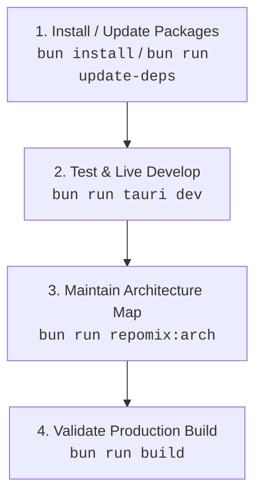

# Minimalistic App

The ultimate minimalistic, high-performance cross-platform desktop application template powered by **Tauri 2**, **Bun.js**, **React 19**, **TypeScript 7**, and **Cargo (Rust)**.

Designed with a sleek **100% AMOLED Deep Black glassmorphic GUI (`#000000`)**, this application operates as a background utility residing in your operating system's taskbar / system tray with full left-click and right-click context menu interaction.

---

## ⚡ Primary Standard & Bun Rule

> [!CRITICAL]
> **1. Package Manager Rule**:
> NEVER use `npm`, `npx`, `yarn`, or `pnpm`. **ALWAYS use `bun`** for package management, script execution, and tooling.
>
> **2. Ultimate Testing Command**:
> The **ONLY** primary command to launch, test, and develop this application is:
> ```bash
> bun run tauri dev
> ```

---

## 📋 Standard Operating Procedure (SOP)



### 1. Dependency Management & Automatic @latest Upgrades
Install or add dependencies using Bun:
```bash
bun install
```
To run the automated **End-to-End Dependency Upgrade & Build Validation Pipeline**:
```bash
bun run update-deps
```
*This single command force-upgrades all dependencies to `@latest` (including TS 7 & Vite 8), updates Cargo crates, builds the Vite production bundle, verifies Rust compilation with `cargo check`, and updates `ARCHITECTURE.md`.*

### 2. Live Development & Primary Testing
Run the application using the ultimate test command:
```bash
bun run tauri dev
```
- **Left-Click Tray Icon**: Toggles GUI window show/hide.
- **Right-Click Tray Icon**: Opens context menu with **Open / Hide GUI** and **Quit**.
- **Close Button (X)**: Minimizes to taskbar tray when enabled in preferences.

### 3. Architecture Maintenance (Repomix)
After adding or modifying files, update the architecture map:
```bash
bun run repomix:arch
```
- Automatically updates [`ARCHITECTURE.md`](ARCHITECTURE.md) with the project directory tree and file inventory descriptions without raw code dumps.

### 4. Production Build Validation
Build the production desktop app binary:
```bash
bun run build
```

---

## 🚀 Key Features & Architecture Highlights

### 🖥️ Native Taskbar & System Tray Integration
- **Left-Click Action**: Toggles showing/hiding the main GUI window instantly.
- **Right-Click Action**: Opens a native context menu with quick options (**Open / Hide GUI** and **Quit**).
- **Window Close Interception**: Closing the main window (X button) hides the app into the system tray when "Minimize to taskbar on close" is enabled.
- **Graceful Teardown**: Quitting sets `is_quitting = true` and invokes `window.close()`, allowing WebView2 to unregister window classes (`Chrome_WidgetWin_0`) cleanly through the Win32 message loop without throwing log errors.

### ⚙️ 1-Tab Preferences GUI
- **Start at OS Launch Toggle** (Default: `OFF`): Managed via `@tauri-apps/plugin-autostart`.
- **Minimize to Taskbar on Close Toggle** (Default: `ON`): Managed via IPC state commands (`get_minimize_to_tray` / `set_minimize_to_tray`).

### 🎨 100% AMOLED Pitch Black Aesthetic
- True pitch black (`#000000`) AMOLED base background.
- Translucent frosted glass cards (`backdrop-filter: blur(20px)`), neon cyan (`#00f2fe`) accent glows, and responsive custom toggle switches.

---

## 🛠️ Tech Stack & Absolute @latest Versions

| Tool / Library | Version | Purpose |
| :--- | :--- | :--- |
| **Bun.js** | `1.3+` | Runtime script runner & package manager |
| **Tauri** | `2.11.4` | Lightweight cross-platform native desktop shell |
| **React** | `19.2.8` | Frontend component framework |
| **TypeScript** | `7.0.2` | Strict static type checking (TypeScript 7) |
| **Vite** | `8.2.0` | Frontend dev server & production bundler (Vite 8) |
| **Repomix** | `1.17.0` | Codebase architecture map generator |
| **Cargo / Rust** | `2021 edition` | Native system tray & background process backend |

---

## 📄 Documentation Links

- [`ARCHITECTURE.md`](ARCHITECTURE.md) - Project directory tree & file inventory.
- [`CHANGELOG.md`](CHANGELOG.md) - Release history.
- [`AGENTS.md`](AGENTS.md) - Agent guidelines & SOP.
