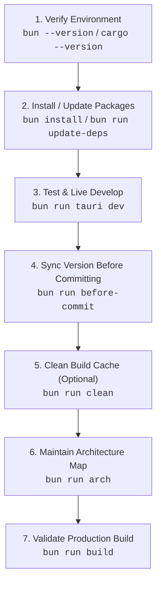

# Minimalistic App

The ultimate minimalistic, high-performance cross-platform desktop application template powered by **Tauri 2**, **Bun.js**, **React 19**, **TypeScript 7**, and **Cargo (Rust 2024 Edition)**.

Designed with a sleek **100% AMOLED Deep Black glassmorphic GUI (`#000000`)**, this application operates as a background utility residing in your operating system's taskbar / system tray with full left-click, right-click context menu interaction, and automated auto-updater support.

---

## ⚡ Primary Standard & Bun Rule

> [!CRITICAL]
> **1. Package Manager Rule**:
> NEVER use `npm`, `npx`, `yarn`, or `pnpm`. **ALWAYS use `bun`** for package management, script execution, and tooling.
>
> **2. Ultimate Testing Command**:
> The **ONLY** primary command to launch, test, and develop this application is:
> ```bash
> bun run tauri dev
> ```
>
> **3. Command Prefix Rule (Agent Operations)**:
> All shell commands — especially `git` — must be prefixed with `rtk` (e.g. `rtk git status`, `rtk bun run typecheck`). RTK is always safe and is the sanctioned wrapper for every command in this repository.

---

## 📋 Standard Operating Procedure (SOP)

Follow this 7-step process when developing, modifying, or testing this repository:



### 1. Environment Verification
Verify that Bun and Cargo/Rust toolchains are installed:
```bash
bun --version
cargo --version
```

### 2. Dependency Management & Automatic @latest Upgrades
Install dependencies using Bun:
```bash
bun install
```
To run the automated **End-to-End Dual-Ecosystem & Sub-Dependency Upgrade Pipeline**:
```bash
bun run update-deps
```
*This 7-step pipeline force-upgrades all direct & transitive sub-dependencies across NPM and Crates.io to `@latest`, updates Cargo crates, validates static TypeScript types (`bun x tsc -b`), builds the Vite production bundle, verifies Rust compilation with `cargo check`, and regenerates `ARCHITECTURE.md`.*

**Flags** (stable-only by default; nothing is ever force-installed beyond what `bun`/`cargo` resolve as compatible):

| Flag | Effect |
| :--- | :--- |
| `--prerelease` | Prefer beta/alpha/RC versions for **direct** dependencies (NPM dist-tags `next`/`beta`/`rc`/`alpha`/`canary`, crates.io `newest_version`) — only targets **strictly newer** than the installed version; falls back to stable. Transitive deps still resolve via `bun update --latest` / `cargo update`. |
| `--dry-run` | Query registries and print a "would upgrade" report **without writing anything** — no `bun add`, no Cargo.toml edits, no lockfile refreshes, no builds. Safe to run any time. |
| `--help` | Print usage summary. |

### 3. Live Development & Primary Testing
Run the application using the ultimate test command:
```bash
bun run tauri dev
```
- **Left-Click Tray Icon**: Toggles GUI window show/hide.
- **Right-Click Tray Icon**: Opens context menu with **Open / Hide GUI**, **Check for Updates...**, and **Quit**.
- **Close Button (X)**: Minimizes to taskbar tray when "Minimize to taskbar on close" is enabled (default: OFF — closing quits by default).

### 4. Version Synchronization Before Committing
Before committing, synchronize the single global application version across every mirror:
```bash
bun run before-commit
```
- `scripts/version.ts` (`APP_VERSION`) is the **single source of truth** — `package.json`, `src-tauri/Cargo.toml`, and `src-tauri/tauri.conf.json` are auto-synced mirrors; the frontend's `__APP_VERSION__` derives from the same constant via Vite `define`.
- `--check` validates without writing (exit 1 on drift) — ideal for CI or a git pre-commit hook (`--install-hook` wires one automatically). CI runs it on every push/PR.
- `--bump <major|minor|patch>` increments `APP_VERSION` and propagates it everywhere.

### 5. Cleaning Build Folders (`bun run clean`)
Purge compiled Rust release & debug build artifacts (`src-tauri/target/`):
```bash
bun run clean
```

### 6. Architecture Maintenance
After adding or modifying files, update the architecture map:
```bash
bun run arch
```
Automatically updates [`ARCHITECTURE.md`](ARCHITECTURE.md) with the project directory tree and file inventory descriptions (size, lines, tokens, chars) without raw code dumps.

### 7. Production Build Validation
Build the production desktop app binary:
```bash
bun run build
```

---

## 🚀 Release Procedure (Exact Order)

Follow these steps **in this order** when bumping the version, preparing a release, and publishing:

1. **Bump & sync the version everywhere** (single command — the global `APP_VERSION` in `scripts/version.ts` is propagated to `package.json`, `Cargo.toml`, `tauri.conf.json`, and `Cargo.lock`):
   ```bash
   bun run before-commit --bump <major|minor|patch>
   ```
   Which bump level fits your change (SemVer)?

   | Bump | Example | Use when | Result |
   | :--- | :--- | :--- | :--- |
   | `patch` | `0.9.0 → 0.9.1` | Bug fixes, corrections, polish — no new behavior. Safest, most common. | patch `+1` |
   | `minor` | `0.9.0 → 0.10.0` | New backward-compatible features (toggles, IPC commands, views). | minor `+1`, patch → `0` |
   | `major` | `0.9.0 → 1.0.0` | Breaking changes — incompatible config/behavior/IPC changes, removals. | major `+1`, minor & patch → `0` |

   > [!NOTE]
   > Below `1.0.0`, anything may be considered breaking per SemVer — the template convention is **patch = fixes, minor = features, major = deliberate breaking overhaul**. Ask the user which level when unspecified.
2. **Update `CHANGELOG.md`** — add the new `## [X.Y.Z] - YYYY-MM-DD` entry at the top (must match the bumped version; each version may appear exactly once).
3. **Update other docs only if version-dependent** (`README.md`, `AUTO-UPDATE.md`, `AGENTS.md`) — usually unnecessary for a patch bump.
4. **Regenerate the architecture map** so metrics include the changelog edit:
   ```bash
   bun run arch
   ```
5. **Validate** — mirrors in sync + static types:
   ```bash
   bun run before-commit --check
   bun run typecheck
   ```
6. **Commit & push** in the repository style:
   ```bash
   rtk git add <files>
   rtk git commit -m "feat(vX.Y.Z): <summary> — <key changes>"
   rtk git push origin main
   ```

> [!IMPORTANT]
> Bump **first**, then changelog, then `arch`, then validate, commit, push. Reversing any two steps breaks the invariants the scripts enforce (e.g. `--check` cannot verify a changelog header that doesn't exist yet).

### `bun run before-commit` — Every Mode

| Command | Effect | Writes? |
| :--- | :--- | :--- |
| `bun run before-commit` | Sync `APP_VERSION` from `scripts/version.ts` into `package.json`, `Cargo.toml`, `tauri.conf.json` (+ `Cargo.lock` via `cargo update`); per-mirror report. | Yes |
| `bun run before-commit --check` | Read-only drift validation; exits `1` on any mismatch. Safe for CI / hooks. | No |
| `bun run before-commit --bump patch` | `0.9.0 → 0.9.1` then sync. | Yes |
| `bun run before-commit --bump minor` | `0.9.0 → 0.10.0` then sync. | Yes |
| `bun run before-commit --bump major` | `0.9.0 → 1.0.0` then sync. | Yes |
| `bun run before-commit --install-hook` | Install `.git/hooks/pre-commit` running `--check`; refuses to overwrite an existing hook. | Yes |
| `bun run before-commit --help` | Print usage. | No |

Details: after a bump, a missing `## [<version>]` changelog header is an advisory `⚠️`, never a blocker. Invalid usage (`--bump` without a part, unknown part, `--check --bump` together) exits `1` with a descriptive message.

---

## 🔑 Key Features & Architecture Highlights

### 🖥️ Native Taskbar & System Tray Integration

The tray icon is the app's primary surface. The full interaction model:

| Trigger | Behavior |
| :--- | :--- |
| **Normal launch** | Window opens on startup (`visible: true` in `tauri.conf.json`). |
| **Second launch** | `tauri-plugin-single-instance` focuses the existing window — no duplicate tray icon. |
| **Left-click tray** | `on_tray_icon_event` → `toggle_window_visibility()` (show or hide). |
| **Right-click tray** | Native context menu: **Open / Hide GUI**, **Check for Updates...**, **Quit**. |
| **Close (X) button** | `CloseRequested` intercept: hides to tray when "minimize to tray" is ON; otherwise quits. |
| **Quit menu item** | Sets `is_quitting = true`, then `window.close()` — clean WebView2 Win32 teardown. |
| **Tray tooltip** | Reads `AppHandle::package_info().name` — can never drift from `tauri.conf.json`. |

**Event flow (tray → webview):**
```
Tray "Check for Updates..." click
   │  show_window_if_hidden(app)        ← only surfaces a hidden window
   │  app.emit("check-for-updates", ())
   ▼
UpdateChecker card (listenForEvents=true) → check() → GitHub Releases API
```

**Graceful Win32 Teardown**: quitting sets `is_quitting = true` and invokes `window.close()`, allowing WebView2 to unregister window classes (`Chrome_WidgetWin_0`) cleanly through the Win32 message loop without log errors.

### ⚙️ IPC Command Surface (Rust ↔ React)

| Command | Direction | Payload | Purpose |
| :--- | :--- | :--- | :--- |
| `get_minimize_to_tray` | Rust → UI | `bool` | Current tray-on-close preference. |
| `set_minimize_to_tray` | UI → Rust | `{ enabled: bool }` → `Result<(), String>` | Persists to disk first, then commits memory; error string surfaces to the UI for optimistic rollback. |
| `get_app_info` | Rust → UI | `AppInfo` (name, version, tauri_version, os, arch) | Reads `AppHandle::package_info()` — single source of truth, never hardcoded. |

All handlers are registered via `tauri::generate_handler!` in `src-tauri/src/lib.rs` and callable from React through `@tauri-apps/api/core` `invoke()`.

### 💾 Disk-Backed Settings Persistence

Preferences serialize to JSON inside the OS config directory, **scoped by the app identifier** (`app_config_dir()`):

| OS | Location |
| :--- | :--- |
| **Windows** | `%APPDATA%\com.minimalistic.app\settings.json` (i.e. `C:\Users\<User>\AppData\Roaming\com.minimalistic.app\settings.json`) |
| **Linux** | `~/.config/com.minimalistic.app/settings.json` |
| **macOS** | `~/Library/Application Support/com.minimalistic.app/settings.json` |

- Corrupt or unreadable files log a `[settings]` warning and fall back to defaults (missing file = quiet defaults).
- The Rust `Mutex` is held only for the in-memory mutation; disk I/O happens after the lock is dropped (never blocking IPC).
- Poisoned-mutex panics are recovered transparently via the `lock_guard()` helper.

### 🔄 Auto-Update Checker (`UpdateChecker.tsx`)

- Integrated GitHub Releases auto-updater powered by `tauri-plugin-updater` and `tauri-plugin-process`.
- **Dual-variant component**: embedded **card** (Preferences tab, primary instance — auto-checks on mount and listens for tray events) and compact **footer** indicator (`autoCheckOnMount={false}`, `listenForEvents={false}` — never fires duplicate network requests).
- **Stable event-listener pattern**: ref-based concurrency guards (`isCheckingRef`, `isInstallingRef`) keep the tray listener's `checkForUpdates` closure stable with an empty dep array.
- Streamed download progress percentages (`Started` / `Progress` / `Finished` events), one-click app relaunch, collapsible release notes drawer, and descriptive error handling (404 → "Update endpoint not found").

### 🔢 Single-Source Version Management

```
scripts/version.ts  (APP_VERSION = "0.9.0")  ← THE ONLY PLACE THE VERSION IS DEFINED
   │
   ├── package.json                (synced by before-commit.ts)
   ├── src-tauri/Cargo.toml        (synced by before-commit.ts)
   ├── src-tauri/tauri.conf.json   (synced by before-commit.ts → drives artifacts + updater feed)
   ├── src-tauri/Cargo.lock        (refreshed via cargo update)
   └── __APP_VERSION__ (Vite define)  ← imported directly by vite.config.ts
```

- `bun run before-commit` (`scripts/before-commit.ts`) propagates `APP_VERSION` to all mirrors, preventing silent version drift.
- `--check` mode exits 1 on drift for CI/pre-commit hooks; `.github/workflows/ci.yml` runs it on every push/PR.
- The frontend receives the version at build time via Vite `define` (`__APP_VERSION__`) — no hardcoded version strings anywhere in `src/`.

### ⚙️ Preferences GUI & Modular Multi-Tab Layout

- **Componentized tabs** (Round 8):
  - `src/components/PreferencesTab.tsx` — owns the autostart / minimize-to-tray toggle state, their IPC initialization, and the embedded update-checker card.
  - `src/components/AboutTab.tsx` — purely presentational System & About metadata view (also exports the shared `AppInfo` type and the browser-preview fallback).
- **Start at OS Launch Toggle** (Default: `OFF`): Managed via `@tauri-apps/plugin-autostart` (macOS AppleScript launcher, `--autostart` arg).
- **Minimize to Taskbar on Close Toggle** (Default: `OFF`): When OFF, closing the window quits the app. When ON, closing hides to taskbar tray. Persisted to disk.
- **Accessibility & Keyboard Control**: Full WAI-ARIA tabs pattern — roving `tabIndex`, `ArrowLeft` / `ArrowRight` cycling, `Home` / `End` jumps. Toggle switches use `role="switch"`, `aria-checked`, `tabIndex`, `onKeyDown` handlers (`Space` / `Enter` toggles), and `:focus-visible` focus ring styles.
- **React `<StrictMode>`**: enabled in `main.tsx` (dev-only double-invocation guard; all mount effects are idempotent).
- **Native Window Drag Region**: Header bar supports `data-tauri-drag-region` for smooth custom window repositioning.

### 🎨 100% AMOLED Pitch Black Aesthetic

- True pitch black (`#000000`) AMOLED base background — painted inline in `index.html` to prevent any white flash before CSS loads.
- Translucent frosted glass cards (`backdrop-filter: blur(20px)`), neon cyan (`#00f2fe`) accent glows, and responsive custom toggle switches.
- Inter font with full antialiasing (`-webkit-font-smoothing` + `-moz-osx-font-smoothing`), `color-scheme: dark` for native dark scrollbars/controls, thin AMOLED scrollbars, and `prefers-reduced-motion` support.

### 🔒 Security, CI/CD & TypeScript Rigor

- **GitHub Actions CI Workflow** (`.github/workflows/ci.yml`): cross-platform validation on `ubuntu-24.04`, `macOS`, and `Windows` runners — TypeScript types (`bun x tsc -b`), **version-mirror drift check** (`bun run before-commit --check`), Vite production bundling, and `cargo check` — on every push and PR.
- Strict **Content Security Policy** in `tauri.conf.json` — allows only Tauri IPC, asset protocol, Google Fonts, and GitHub release endpoints.
- Isolated TypeScript compilation context for Node.js scripts (`tsconfig.scripts.json`) preventing DOM/Node type collisions.
- Full type safety enforced with `noUnusedLocals: true` and `noUnusedParameters: true`.
- Chromium 105 build target (`vite.config.ts`) matching the embedded webview baseline across Windows (WebView2), macOS (WKWebView), and Linux (WebKitGTK) — no unnecessary ES transpilation.
- Resizable preferences window with minimum dimensions (`minWidth: 380`, `minHeight: 480`), so the layout never overflows on small or high-DPI-scaled displays.

---

## 🛠️ Tech Stack & Absolute @latest Versions

| Tool / Library | Version | Purpose |
| :--- | :--- | :--- |
| **Bun.js** | `1.3+` | Runtime, script runner & package manager |
| **Tauri** | `^2.11.5` | Lightweight cross-platform native desktop shell |
| **React** | `^19.2.8` | Frontend component framework |
| **TypeScript** | `^7.0.2` | Strict static type checking (TypeScript 7) |
| **Vite** | `^8.2.0` | Frontend dev server & production bundler (Vite 8) |
| **Cargo / Rust** | `2024 edition` | Native system tray & background process backend |

### Tauri Plugins

| Plugin | Version | Purpose |
| :--- | :--- | :--- |
| `tauri-plugin-autostart` | `^2.5.1` | OS startup launch management |
| `tauri-plugin-single-instance` | `^2.4.3` | Duplicate-launch prevention & window focus |
| `tauri-plugin-updater` | `^2.10.1` | GitHub Releases auto-update |
| `tauri-plugin-process` | `^2.3.1` | App relaunch after update install |

---

## 📁 Project Structure (Annotated)

```
Minimalistic_App/
├── src/                          # React 19 frontend (TypeScript)
│   ├── lib/
│   │   └── tauri.ts              # isTauri runtime detection (single shared check)
│   ├── components/
│   │   ├── ToggleSwitch.tsx      # Accessible ARIA switch (Space/Enter, focus ring)
│   │   ├── UpdateChecker.tsx     # Auto-update UI (card + footer variants)
│   │   ├── PreferencesTab.tsx    # Preferences panel: toggles + update card (owns their state)
│   │   └── AboutTab.tsx          # System & About panel (presentational; exports AppInfo)
│   ├── App.tsx                   # Application shell: tabs, header, footer, status bar
│   ├── main.tsx                  # React entry point (<StrictMode>)
│   └── index.css                 # AMOLED black design system (design tokens, glassmorphism)
├── src-tauri/                    # Rust backend (Tauri 2)
│   ├── src/lib.rs                # Tray, IPC commands, window lifecycle, settings persistence
│   ├── src/main.rs               # Entry point (no Windows console in release)
│   ├── capabilities/default.json # Tauri v2 capability permissions
│   ├── Cargo.toml                # Rust manifest (version synced by before-commit.ts)
│   ├── build.rs                  # tauri-build bootstrap
│   ├── icons/                    # Generated icon set (PNG/ICO/ICNS — `bun run create-icons`)
│   └── tauri.conf.json           # App config, CSP, updater endpoints (version synced)
├── scripts/                      # Node.js tooling (isolated tsconfig.scripts.json)
│   ├── version.ts                # APP_VERSION — global single source of truth
│   ├── before-commit.ts          # Version sync & validation (--check / --bump / --install-hook)
│   ├── generate-arch.ts          # ARCHITECTURE.md generator (Repomix pack() API)
│   ├── create-icons.ts           # Cross-platform PNG/ICO/ICNS icon generator
│   └── update-deps.ts            # Dual-ecosystem 7-step upgrade pipeline
├── .github/workflows/ci.yml      # Cross-platform CI (types, version sync, Vite, cargo)
├── tsconfig.json                 # Frontend TypeScript config (strict, noUnusedLocals)
├── tsconfig.scripts.json         # Scripts TypeScript config (isolated Node context)
├── vite.config.ts                # Vite config (target chrome105, injects __APP_VERSION__)
├── repomix.config.json           # Repomix metadata-only collection rules
└── index.html                    # HTML entry (anti-flash black, color-scheme: dark)
```

---

## 🚀 From Template to Your App

Turning this template into your own application, in order:

1. **Pick a product name & identifier** — edit `src-tauri/tauri.conf.json`:
   - `productName` (display name, window title, bundle name)
   - `identifier` (reverse-DNS, e.g. `com.yourcompany.yourapp` — **must be unique per app**)
   - `app.windows[0].title` (window title bar)
2. **Sync the identifiers** — `package.json` → `name`, `src-tauri/Cargo.toml` → `package.name`, `src-tauri/Cargo.lock` → root `[[package]]` name, `scripts/before-commit.ts` → `CARGO_CRATE_NAME`, and the tray `tooltip` (auto-reads from `package_info()` — no manual edit needed).
3. **Regenerate the icons** — `bun run create-icons` produces all PNG/ICO/ICNS sizes in the brand color.
4. **Bump the version** — `bun run before-commit --bump minor` (or edit `scripts/version.ts` then run plain `bun run before-commit`).
5. **Wire up auto-updates** (optional) — see [`AUTO-UPDATE.md`](AUTO-UPDATE.md):
   - Replace the placeholder `plugins.updater.pubkey` with your Minisign public key.
   - Point `plugins.updater.endpoints` at your GitHub repo's `latest.json`.
   - Add `TAURI_SIGNING_PRIVATE_KEY` / `TAURI_SIGNING_PRIVATE_KEY_PASSWORD` repository secrets.
   - Commit `.github/workflows/release.yml` (template in `AUTO-UPDATE.md`) and push a `v*` tag.
6. **Rebrand the GUI text** — `App.tsx` (brand title), `AboutTab.tsx` (`WEB_PREVIEW_APP_INFO`, notes list), `index.html` (`<title>`).
7. **Update the docs** — regenerate `ARCHITECTURE.md` (`bun run arch`) and refresh README/CHANGELOG for the new name.

---

## 🧰 Troubleshooting Cheatsheet

| Symptom | Fix |
| :--- | :--- |
| App quits when closing the window | That's the default (`minimize_to_tray: false`). Enable the toggle in Preferences. |
| No tray icon on Linux | System tray requires `libayatana-appindicator3-dev` + `libxdo-dev` (and a tray-supporting desktop shell). CI installs them for Ubuntu. |
| Devtools not opening | WebView2 devtools are disabled in release builds by design; in dev, right-click → Inspect or `bun run tauri dev -- --devtools`. |
| "Update endpoint not found (GitHub release pending)" | No release published yet, or `endpoints` URL doesn't match your repo. Publish a tag via the release workflow. |
| Version mismatch between files | Run `bun run before-commit` (sync) or `--check` (diagnose). CI blocks drifted pushes. |
| White flash on app start | Shouldn't happen — `index.html` paints `#000` inline. If it returns, verify the inline `<style>` survived bundling. |
| `cargo` commands fail after edits | Run `bun run before-commit` (refreshes `Cargo.lock` root entry) or `cargo check` inside `src-tauri/`. |

---

## 📄 Documentation Links

- [`ARCHITECTURE.md`](ARCHITECTURE.md) — Project directory tree & file inventory (auto-generated).
- [`AUTO-UPDATE.md`](AUTO-UPDATE.md) — Auto-updater and GitHub Releases setup.
- [`CHANGELOG.md`](CHANGELOG.md) — Release history.
- [`AGENTS.md`](AGENTS.md) — Agent guidelines, SOP & best practices.
