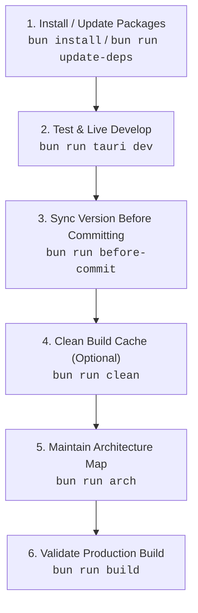

# Minimalistic App

The ultimate minimalistic, high-performance cross-platform desktop application template powered by **Tauri 2**, **Bun.js**, **React 19**, **TypeScript 7**, and **Cargo (Rust 2024 Edition)**.

Designed with a sleek **100% AMOLED Deep Black glassmorphic GUI (`#000000`)**, this application operates as a background utility residing in your operating system's taskbar / system tray with full left-click, right-click context menu interaction, and automated auto-updater support.

---

## ⚡ Primary Standard & Bun Rule

> [!CRITICAL]
> **1. Package Manager Rule**:
> NEVER use `npm`, `npx`, `yarn`, or `pnpm`. **ALWAYS use `bun`** for package management, script execution, and tooling.
>
> **2. Ultimate Testing Command**:
> The **ONLY** primary command to launch, test, and develop this application is:
> ```bash
> bun run tauri dev
> ```

---

## 📋 Standard Operating Procedure (SOP)



### 1. Dependency Management & Automatic @latest Upgrades
Install dependencies using Bun:
```bash
bun install
```
To run the automated **End-to-End Dual-Ecosystem & Sub-Dependency Upgrade Pipeline**:
```bash
bun run update-deps
```
*This 7-step pipeline force-upgrades all direct & transitive sub-dependencies across NPM and Crates.io to `@latest`, updates Cargo crates, validates static TypeScript types (`bun x tsc -b`), builds the Vite production bundle, verifies Rust compilation with `cargo check`, and regenerates `ARCHITECTURE.md`.*

### 2. Live Development & Primary Testing
Run the application using the ultimate test command:
```bash
bun run tauri dev
```
- **Left-Click Tray Icon**: Toggles GUI window show/hide.
- **Right-Click Tray Icon**: Opens context menu with **Open / Hide GUI**, **Check for Updates...**, and **Quit**.
- **Close Button (X)**: Minimizes to taskbar tray when "Minimize to taskbar on close" is enabled (default: OFF — closing quits by default).

### 3. Version Synchronization Before Committing
Before committing, synchronize the single global application version across every mirror:
```bash
bun run before-commit
```
- `scripts/version.ts` (`APP_VERSION`) is the **single source of truth** — `package.json`, `src-tauri/Cargo.toml`, and `src-tauri/tauri.conf.json` are auto-synced mirrors; the frontend's `__APP_VERSION__` derives from the same constant via Vite `define`.
- `--check` validates without writing (exit 1 on drift) — ideal for CI or a git pre-commit hook (`--install-hook` wires one automatically).
- `--bump <major|minor|patch>` increments `APP_VERSION` and propagates it everywhere.

### 4. Cleaning Build Folders (`bun run clean`)
Purge compiled Rust release & debug build artifacts (`src-tauri/target/`):
```bash
bun run clean
```

### 5. Architecture Maintenance
After adding or modifying files, update the architecture map:
```bash
bun run arch
```
Automatically updates [`ARCHITECTURE.md`](ARCHITECTURE.md) with the project directory tree and file inventory descriptions without raw code dumps.

### 6. Production Build Validation
Build the production desktop app binary:
```bash
bun run build
```

---

## 🚀 Release Procedure (Exact Order)

Follow these steps **in this order** when bumping the version, preparing a release, and publishing:

1. **Bump & sync the version everywhere** (single command — the global `APP_VERSION` in `scripts/version.ts` is propagated to `package.json`, `Cargo.toml`, `tauri.conf.json`, and `Cargo.lock`):
   ```bash
   bun run before-commit --bump <major|minor|patch>
   ```
   Which bump level fits your change (SemVer)?

   | Bump | Example | Use when | Result |
   | :--- | :--- | :--- | :--- |
   | `patch` | `0.8.1 → 0.8.2` | Bug fixes, corrections, polish — no new behavior. Safest, most common. | patch `+1` |
   | `minor` | `0.8.1 → 0.9.0` | New backward-compatible features (toggles, IPC commands, views). | minor `+1`, patch → `0` |
   | `major` | `0.8.1 → 1.0.0` | Breaking changes — incompatible config/behavior/IPC changes, removals. | major `+1`, minor & patch → `0` |

   > [!NOTE]
   > Below `1.0.0`, anything may be considered breaking per SemVer — the template convention is **patch = fixes, minor = features, major = deliberate breaking overhaul**. Ask the user which level when unspecified.
2. **Update `CHANGELOG.md`** — add the new `## [X.Y.Z] - YYYY-MM-DD` entry at the top (must match the bumped version).
3. **Update other docs only if version-dependent** (`README.md`, `AUTO-UPDATE.md`, `AGENTS.md`) — usually unnecessary for a patch bump.
4. **Regenerate the architecture map** so metrics include the changelog edit:
   ```bash
   bun run arch
   ```
5. **Validate** — mirrors in sync + static types:
   ```bash
   bun run before-commit --check
   bun run typecheck
   ```
6. **Commit & push** in the repository style:
   ```bash
   rtk git add <files>
   rtk git commit -m "feat(vX.Y.Z): <summary> — <key changes>"
   rtk git push origin main
   ```

> [!IMPORTANT]
> Bump **first**, then changelog, then `arch`, then validate, commit, push. Reversing any two steps breaks the invariants the scripts enforce (e.g. `--check` cannot verify a changelog header that doesn't exist yet).

### `bun run before-commit` — Every Mode

| Command | Effect | Writes? |
| :--- | :--- | :--- |
| `bun run before-commit` | Sync `APP_VERSION` from `scripts/version.ts` into `package.json`, `Cargo.toml`, `tauri.conf.json` (+ `Cargo.lock` via `cargo update`); per-mirror report. | Yes |
| `bun run before-commit --check` | Read-only drift validation; exits `1` on any mismatch. Safe for CI / hooks. | No |
| `bun run before-commit --bump patch` | `0.8.1 → 0.8.2` then sync. | Yes |
| `bun run before-commit --bump minor` | `0.8.1 → 0.9.0` then sync. | Yes |
| `bun run before-commit --bump major` | `0.8.1 → 1.0.0` then sync. | Yes |
| `bun run before-commit --install-hook` | Install `.git/hooks/pre-commit` running `--check`; refuses to overwrite an existing hook. | Yes |
| `bun run before-commit --help` | Print usage. | No |

Details: after a bump, a missing `## [<version>]` changelog header is an advisory `⚠️`, never a blocker. Invalid usage (`--bump` without a part, unknown part, `--check --bump` together) exits `1` with a descriptive message.

---

## 🚀 Key Features & Architecture Highlights

### 🖥️ Native Taskbar & System Tray Integration
- **Normal Launch**: App opens its window on startup (`visible: true` in `tauri.conf.json`).
- **Single-Instance Enforcement**: Launching the app a second time focuses the existing window instead of spawning a duplicate tray icon (`tauri-plugin-single-instance`).
- **Left-Click Action**: Toggles showing/hiding the main GUI window instantly.
- **Right-Click Action**: Opens a native context menu (**Open / Hide GUI**, **Check for Updates...**, **Quit**).
- **Window Close Interception**: Closing the main window (X button) hides the app into the system tray when "Minimize to taskbar on close" is enabled (default: OFF — closing quits by default).
- **Graceful Win32 Teardown**: Quitting sets `is_quitting = true` and invokes `window.close()`, allowing WebView2 to unregister window classes (`Chrome_WidgetWin_0`) cleanly through the Win32 message loop without log errors.
- **Tray Tooltip**: Hovering the tray icon displays the app name on all supported platforms.

### 🔄 Auto-Update Checker (`UpdateChecker.tsx`)
- Integrated GitHub Releases auto-updater powered by `tauri-plugin-updater` and `tauri-plugin-process`.
- Stable event-listener pattern — tray-triggered checks always use live logic via ref-based concurrency guards (`isCheckingRef`, `isInstallingRef`).
- Streamed download progress percentages, one-click app relaunch, and error handling.
- Dual-variant component: embedded **card** in the settings panel and compact **footer** indicator.

### ⚙️ Preferences GUI & Modular Multi-Tab Layout
- **Modular Multi-Tab Navigation**: Built-in tab navigation separating **Preferences** and **System & About** diagnostic views.
- **Disk-Backed Settings Persistence**: User settings (`minimize_to_tray`) automatically serialize to `$APP_DATA_DIR/<AppName>/settings.json` (explicitly inside an application subfolder in AppData) via native Rust I/O so preferences persist across app restarts.
- **Start at OS Launch Toggle** (Default: `OFF`): Managed via `@tauri-apps/plugin-autostart`.
- **Minimize to Taskbar on Close Toggle** (Default: `OFF`): When OFF, closing the window quits the app. When ON, closing hides to taskbar tray.
- **Accessibility & Keyboard Control**: Controls feature `role="switch"`, `aria-checked`, `tabIndex`, `onKeyDown` handlers (`Space` / `Enter` toggles), and `:focus-visible` focus ring styles.
- **Native Window Drag Region**: Header bar supports `data-tauri-drag-region` for smooth custom window repositioning.

### 🎨 100% AMOLED Pitch Black Aesthetic
- True pitch black (`#000000`) AMOLED base background.
- Translucent frosted glass cards (`backdrop-filter: blur(20px)`), neon cyan (`#00f2fe`) accent glows, and responsive custom toggle switches.
- Inter font with full antialiasing (`-webkit-font-smoothing` + `-moz-osx-font-smoothing`).

### 🔢 Single-Source Version Management
- `scripts/version.ts` exports the global `APP_VERSION` constant — the **only** place the app version is defined.
- `bun run before-commit` (`scripts/before-commit.ts`) propagates it to `package.json`, `src-tauri/Cargo.toml`, and `src-tauri/tauri.conf.json` (and refreshes the `Cargo.lock` root entry), preventing silent version drift.
- `--check` mode exits 1 on drift for CI/pre-commit hooks (`--install-hook` installs one), and `--bump <major|minor|patch>` bumps + syncs the whole chain.
- The frontend receives the version at build time via Vite `define` (`__APP_VERSION__`) — no hardcoded version strings anywhere in `src/`.

### 🔒 Security, CI/CD & TypeScript Rigor
- **GitHub Actions CI Workflow**: Automated cross-platform CI pipeline (`.github/workflows/ci.yml`) performing type checking (`bun x tsc -b`), Vite bundling, and Cargo compilation on push and PR across **Linux (ubuntu-22.04), macOS, and Windows** runners.
- Strict **Content Security Policy** configured in `tauri.conf.json` — allows only Tauri IPC, asset protocol, Google Fonts, and GitHub release endpoints.
- Isolated TypeScript compilation context for Node.js scripts (`tsconfig.scripts.json`) preventing DOM/Node type collisions.
- Full type safety enforced with `noUnusedLocals: true` and `noUnusedParameters: true`.
- Chromium 105 build target (`vite.config.ts`) matching the embedded webview baseline across Windows (WebView2), macOS (WKWebView), and Linux (WebKitGTK) — no unnecessary ES transpilation.
- Resizable preferences window with minimum dimensions, so the layout never overflows on small or high-DPI-scaled displays.

---

## 🛠️ Tech Stack & Absolute @latest Versions

| Tool / Library | Version | Purpose |
| :--- | :--- | :--- |
| **Bun.js** | `1.3+` | Runtime, script runner & package manager |
| **Tauri** | `^2.11.5` | Lightweight cross-platform native desktop shell |
| **React** | `^19.2.8` | Frontend component framework |
| **TypeScript** | `^7.0.2` | Strict static type checking (TypeScript 7) |
| **Vite** | `^8.2.0` | Frontend dev server & production bundler (Vite 8) |
| **Cargo / Rust** | `2024 edition` | Native system tray & background process backend |

### Tauri Plugins

| Plugin | Version | Purpose |
| :--- | :--- | :--- |
| `tauri-plugin-autostart` | `^2.5.1` | OS startup launch management |
| `tauri-plugin-single-instance` | `^2.4.3` | Duplicate-launch prevention & window focus |
| `tauri-plugin-updater` | `^2.10.1` | GitHub Releases auto-update |
| `tauri-plugin-process` | `^2.3.1` | App relaunch after update install |

---

## 📁 Project Structure

```
Minimalistic_App/
├── src/                        # React frontend (TypeScript)
│   ├── lib/
│   │   └── tauri.ts            # Shared Tauri runtime detection (isTauri)
│   ├── components/
│   │   ├── ToggleSwitch.tsx    # Accessible ARIA switch component (keyboard-friendly)
│   │   └── UpdateChecker.tsx   # Auto-update UI component (card + footer variants)
│   ├── App.tsx                 # Main preferences GUI
│   ├── main.tsx                # React entry point
│   └── index.css               # AMOLED black design system
├── src-tauri/                  # Rust backend (Tauri 2)
│   ├── src/lib.rs              # Tray, IPC commands, window lifecycle
│   ├── capabilities/
│   │   └── default.json        # Tauri v2 capability permissions
│   └── tauri.conf.json         # App config, CSP, updater endpoints
├── scripts/
│   ├── before-commit.ts         # Single-source version sync & validation (--check/--bump/--install-hook)
│   ├── generate-arch.ts         # ARCHITECTURE.md generator
│   ├── create-icons.ts          # Cross-platform PNG/ICO/ICNS icon generator
│   ├── update-deps.ts           # Dual-ecosystem 7-step upgrade pipeline
│   └── version.ts               # APP_VERSION — global single source of truth
├── tsconfig.json               # Frontend TypeScript config
├── tsconfig.scripts.json       # Scripts TypeScript config (isolated Node context)
└── vite.config.ts              # Vite bundler config (target: chrome105, injects __APP_VERSION__)
```

---

## 📄 Documentation Links

- [`ARCHITECTURE.md`](ARCHITECTURE.md) — Project directory tree & file inventory.
- [`AUTO-UPDATE.md`](AUTO-UPDATE.md) — Auto-updater and GitHub Releases setup.
- [`CHANGELOG.md`](CHANGELOG.md) — Release history.
- [`AGENTS.md`](AGENTS.md) — Agent guidelines & SOP.
