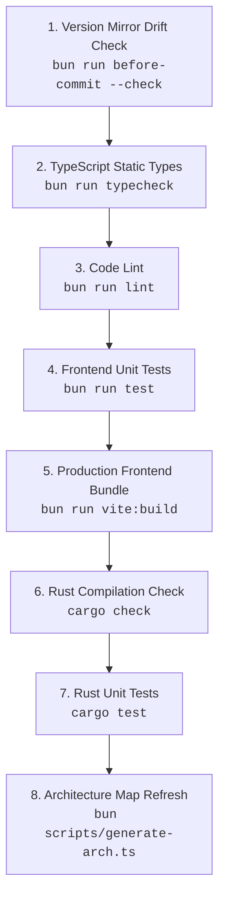

# Testing & Quality Assurance Guide

This document defines the testing strategy, automated quality gates, and manual verification procedures for **Minimalistic App**.

---

## ⚡ Quick Testing Commands

```bash
# 1. Frontend unit tests (Bun's built-in runner, everything under test/)
bun run test                     # ALWAYS via the script — see the warning below
bun run test test/keyboard.test.ts   # a single file
bun run test -- --watch              # re-run on change

# 1b. Rust unit tests (backend settings, log tailing, window geometry)
cargo test --manifest-path src-tauri/Cargo.toml

# 1c. The full 8-gate pre-commit validation suite (runs both of the above)
bun run validate

# 2. Static TypeScript Type Checking (tsc -b)
bun run typecheck

# 3. Code Lint (oxlint — TS7-compatible)
bun run lint
bun run lint:fix   # auto-fix variant

# 4. Code Formatting Verification (Prettier + cargo fmt)
bun run format:check

# 5. Version Synchronization Validation (Mirror drift check)
bun run before-commit --check

# 6. Refresh the local documentation mirrors (Tauri 2 / SolidJS 2 / Bun / TypeScript)
bun run docs:sync
bun run docs:check

# 7. Live Development & Interactive Testing
bun run tauri dev
```

---

> [!WARNING]
> **Always run the tests through `bun run test`, never a bare `bun test`.**
>
> The script is `bun test --conditions browser`, and that flag is load-bearing.
> `solid-js` publishes several builds and its **default** Node/Bun export
> condition is the **SSR build** (`"main": "./dist/server.cjs"`). In that build
> effects never run and writes never propagate through the graph — so a bare
> `bun test` would exercise a runtime the app never ships, and a reactivity test
> could pass by doing nothing at all. `--conditions browser` selects
> `dist/solid.js`, the same client runtime Vite bundles into the webview.
>
> `bun run validate` and the CI workflow both invoke `bun run test`, so they are
> already correct; only an ad-hoc `bun test` in a terminal is a trap.

## 🛡️ The 8-Gate Pre-Commit Quality Suite (`bun run validate`)

The automated validation pipeline runs 8 gates sequentially, ordered cheapest-first
so a broken build fails fast (~6 seconds warm):



1. **Version Sync Gate**: Ensures `package.json`, `src-tauri/Cargo.toml`, and `src-tauri/tauri.conf.json` exactly match `APP_VERSION` in `scripts/version.ts`.
2. **TypeScript Type Gate**: Runs `tsc -b` over `src/`, `test/`, `vite.config.ts`, and `scripts/` with strict null checks, `noUnusedLocals`, `noUncheckedIndexedAccess`, and `exactOptionalPropertyTypes`.
3. **Code Lint Gate**: Runs oxlint (TS7-compatible) with correctness/suspicious/perf categories plus unicorn, typescript, and import plugin rules.
4. **Frontend Unit Test Gate**: Runs every `test/*.test.ts` file through Bun's built-in runner.
5. **Vite Production Build Gate**: Compiles the production frontend bundle into `dist/` to catch bundler, CSS token, or asset resolution issues.
6. **Rust Cargo Compilation Gate**: Verifies backend compilation against Tauri v2 and OS APIs.
7. **Rust Unit Test Gate**: Runs the `src-tauri` test module — settings defaults, JSON round-trip, atomic persistence, corrupt-file quarantine, log tailing, and window-position guards.
8. **Architecture Map Gate**: Refreshes `ARCHITECTURE.md` with accurate file metrics and directory trees.

> The gates use package-script indirection (`bun run lint`, not a hardcoded oxlint
> invocation), so changing a script in `package.json` updates the suite, CI, and
> the git hook together.

---

## 🧪 Unit Test Layout

| File                                | Covers                                                                                                                                                    |
| :---------------------------------- | :-------------------------------------------------------------------------------------------------------------------------------------------------------- |
| `test/keyboard.test.ts`             | Hotkey spec parsing/formatting, platform modifier resolution (`Mod` → ⌘/Ctrl), layout-independent matching, side-aware listener.                          |
| `test/shortcuts.test.ts`            | Shortcut registry integrity, rebinding + override persistence, conflict detection, event→action resolution.                                               |
| `test/logViewer.test.ts`            | Log severity classification and live-vs-disk line reconciliation.                                                                                         |
| `test/settings.test.ts`             | Settings backup sanitizer — type coercion, unknown-field rejection, geometry validation, schema-version passthrough.                                      |
| `test/hardening.test.ts`            | Which browser shortcuts are swallowed in a release build and — just as important — which are never touched (copy/paste, and anything typed into a field). |
| `test/theme.test.ts`                | Theme preset integrity, pure accent resolution (`resolveThemeAccent`), and CSS custom-property application.                                               |
| `test/storage.test.ts`              | Fail-soft `localStorage` helpers — working store, a store that throws on every call, and a missing global.                                                |
| `test/reactivity.test.ts`           | SolidJS 2 contracts the components depend on: writable derived signals, async-memo not-ready reads, and the effect-cleanup rule.                          |
| `test/bindings.test.ts`             | Rust ↔ TypeScript IPC contract — the `collect_commands![…]` registry must match the generated wrappers in `src/bindings.ts`.                              |
| `test/version.test.ts`              | SemVer format of `APP_VERSION`.                                                                                                                           |
| `src-tauri/src/lib.rs`              | (`#[cfg(test)] mod tests`) Rust-side settings, persistence, window geometry, and end-to-end settings repair.                                              |
| `src-tauri/src/settings_repair.rs`  | Field-level repair — wrong types, missing keys, unknown keys preserved, nested collections, path parsing, default merging.                                |
| `src-tauri/src/settings_migrate.rs` | Schema-version ladder — legacy stamping, idempotency, a document from a newer build, and the v0→v1 hotkey normalization rules.                            |
| `src-tauri/src/cli.rs`              | Flag parsing — `--autostart` implying hidden, request precedence, log-level spellings, and the rule that unknown arguments never abort a launch.          |
| `src-tauri/src/portable.rs`         | Portable-mode marker detection and data-directory resolution.                                                                                             |
| `src-tauri/src/webview_runtime.rs`  | The engine folder name and override variable, which fail _open_ (app works, portable mode leaks) if they drift.                                           |
| `src-tauri/src/autostart.rs`        | Development-build detection and the IPC status shape.                                                                                                     |
| `src-tauri/src/panic_log.rs`        | Panic description — string, formatted and non-string payloads, and named background threads.                                                              |

---

## 🌐 Browser Dev Preview Testing (`bun run vite`)

To test UI components, responsive layout, animations, and ARIA keyboard navigation without compiling the Rust backend:

```bash
bun run vite
```

### Web Preview Expectations:

- The top header badge renders **"Web Preview"** (amber indicator).
- Tauri-only features (e.g. autostart, minimize-to-tray IPC) gracefully fall back to web-safe defaults without unhandled errors.
- "Copy Diagnostics" copies fallback web runtime diagnostic information.

---

## 🖥️ Desktop Native Manual QA Matrix (`bun run tauri dev`)

Run through this test matrix when testing native desktop features:

| Feature Area                 | Action / Test Step                                                         | Expected Behavior                                                                                                                                 |
| :--------------------------- | :------------------------------------------------------------------------- | :------------------------------------------------------------------------------------------------------------------------------------------------ |
| **Tray Left-Click**          | Left-click the taskbar / system tray icon.                                 | Toggles GUI window visibility (hides if open, shows & focuses if hidden).                                                                         |
| **Tray Context Menu**        | Right-click the tray icon.                                                 | Opens native menu with: `Open / Hide GUI`, `Check for Updates...`, `Quit`.                                                                        |
| **Tray "Open / Hide GUI"**   | Click "Open / Hide GUI" in context menu.                                   | Toggles window visibility identically to left-click.                                                                                              |
| **Tray "Check for Updates"** | Click "Check for Updates..." with window hidden.                           | Surfaces and focuses the main window and triggers the update checker.                                                                             |
| **Close Button (Default)**   | Click window close button (X) with "Minimize on close" OFF.                | The application process terminates cleanly and tray icon disappears.                                                                              |
| **Minimize to Tray Toggle**  | Enable "Minimize to taskbar on close" in Preferences.                      | Setting persists to `%APPDATA%/com.minimalistic.app/settings.json`.                                                                               |
| **Close Button (Minimized)** | Click window close button (X) with "Minimize on close" ON.                 | Window hides to system tray; process remains active.                                                                                              |
| **Autostart Toggle**         | Toggle "Start application on system login".                                | Toggles OS autostart registration via `@tauri-apps/plugin-autostart`.                                                                             |
| **Copy Diagnostics**         | Click "Copy Diagnostics" in System & About tab.                            | Copies formatted markdown diagnostics to clipboard; button displays green checkmark feedback.                                                     |
| **Keyboard Navigation**      | Use `Tab`, `ArrowLeft`/`ArrowRight`, `Space`, `Enter`.                     | Full roving tab focus across tabs and switches; Space/Enter toggles switches.                                                                     |
| **Global Shortcuts**         | Press `Ctrl/Cmd+1..3`, `Ctrl/Cmd+,`, `Ctrl/Cmd+/`, `?`.                    | Switches tabs / opens the cheat sheet. Labels render `⌘1` on macOS and `Ctrl+1` elsewhere.                                                        |
| **Shortcut Rebinding**       | Open the cheat sheet, click a chord, press a new combination.              | The row arms (pulsing outline), previews the held chord live, then commits. The old chord stops working and the new one takes effect immediately. |
| **Rebind Conflict**          | Rebind one shortcut onto another's chord.                                  | A warning toast names the other command, and an amber note appears under the row.                                                                 |
| **Rebind Persistence**       | Rebind, then fully restart the app.                                        | The custom binding survives; "Reset All Shortcuts" restores every default.                                                                        |
| **Recorder Isolation**       | Arm a recorder, then press the chord currently bound to another action.    | The chord is captured, **not** executed — the armed recorder owns the keyboard.                                                                   |
| **Start Minimized**          | Enable "Start silently minimized", restart the app.                        | No window flash on launch; the app appears only in the tray.                                                                                      |
| **Window Geometry**          | Enable "Remember window size/position", move + resize, close, relaunch.    | The window reopens at the last size/position; `settings.json` is written once on close, not during the drag.                                      |
| **Global Hotkey — Enable**   | Preferences → Global Hotkeys → enable, then bind "Show / hide the window". | Status reads "Listening — 1 bound"; the log shows `[hotkeys] Global hotkey listener started`.                                                     |
| **Global Hotkey — Fires**    | Focus another application, then press the bound chord.                     | The window toggles; a toast names the action; the log shows `[hotkeys] Global hotkey fired`.                                                      |
| **Global Hotkey — Blocking** | Bind a chord another app uses, then press it inside that app.              | Windows/macOS withhold it from that app. On Linux without `/dev/uinput` the status says detect-only and the chord still reaches it.               |
| **Global Hotkey — Conflict** | Bind the same chord to a second action.                                    | Rejected with a toast naming the action that already owns it; the first binding is unchanged.                                                     |
| **Global Hotkey — Teardown** | Disable the toggle, then quit from the tray.                               | Listener stops and the OS keyboard hook is released before the process exits.                                                                     |
| **Global Hotkey — macOS**    | Enable on macOS without Accessibility granted.                             | An inline prompt appears with a button that opens the Accessibility settings pane directly.                                                       |
| **Tray "Quit"**              | Click "Quit" from the tray context menu.                                   | Sets `is_quitting = true` and performs graceful Win32 window class teardown without errors.                                                       |
| **CLI — help / version**     | From a terminal, run `minimalistic-app --version` and `--help`.            | Output appears **in that terminal**, in a release build too. If nothing prints on Windows, the parent-console attach in `cli.rs` has regressed.   |
| **CLI — start hidden**       | Launch with `--hidden`.                                                    | No window; the tray icon appears. `--autostart` behaves the same and additionally logs `Started by the OS launch entry`.                          |
| **CLI — second launch**      | With the app running, launch it again with `--toggle`, then `--show`.      | The **existing** window toggles / raises. No second window, no second tray icon, and the second process exits immediately.                        |
| **CLI — remote quit**        | With the app running, launch it again with `--quit`.                       | The running instance shuts down exactly as the tray "Quit" does. With nothing running, the message says so instead of silently doing nothing.     |
| **CLI — junk arguments**     | Launch with `--frobnicate /some/path`.                                     | The app starts normally and logs one warning naming the ignored arguments. A GUI app must never fail to launch over an argument a shell injected. |
| **CLI — log level**          | Launch with `--log-level=debug`, open the Dev Console.                     | Debug-level backend lines appear. `RUST_LOG=debug` does the same; the flag wins when both are set.                                                |
| **Autostart — login launch** | Enable autostart in a **release** build, reboot, log in.                   | The app starts into the tray **without** showing a window, even with "Start silently minimized" off — that is `--autostart` being read.           |

### Release-only webview hardening

These behave differently in `bun run tauri dev` **on purpose** — a dev build keeps
its browser keys. Verify against a real release build (`bun run build`).

| Feature Area               | Action / Test Step                                                | Expected Behavior                                                                                                         |
| :------------------------- | :---------------------------------------------------------------- | :------------------------------------------------------------------------------------------------------------------------ |
| **No reload**              | Press `F5`, then `Ctrl/Cmd+R`.                                    | Nothing happens. The active tab, status message and any open modal are unchanged — a reload would have reset all of them. |
| **No print / find / zoom** | Press `Ctrl/Cmd+P`, `Ctrl/Cmd+F`, `Ctrl/Cmd+±`, `Ctrl/Cmd+0`.     | No print dialog, no browser find bar over the UI, and the layout does not scale.                                          |
| **Editing still works**    | Focus a text field. Type, then `Ctrl/Cmd+A`, `+C`, `+V`, `+Z`.    | All normal. Select-all, copy, paste and undo are OS text editing, and are never intercepted.                              |
| **Field owns its keys**    | With focus in a text field, press `Ctrl/Cmd+F` and `F5`.          | Still nothing — but for the _other_ reason: input targets are skipped before any rule is consulted.                       |
| **No drop-navigation**     | Drag any file (a PDF, an image) onto the window and release.      | Nothing happens. Un-guarded, the whole UI is replaced by that file with no way back except restarting.                    |
| **No browser menu**        | Right-click the window background, then right-click a text field. | Background: no menu. Text field: the native cut/copy/paste menu still appears.                                            |
| **Dev build is exempt**    | Repeat the above under `bun run tauri dev`.                       | `F5` reloads and devtools open, as they must while you are working on the frontend.                                       |
