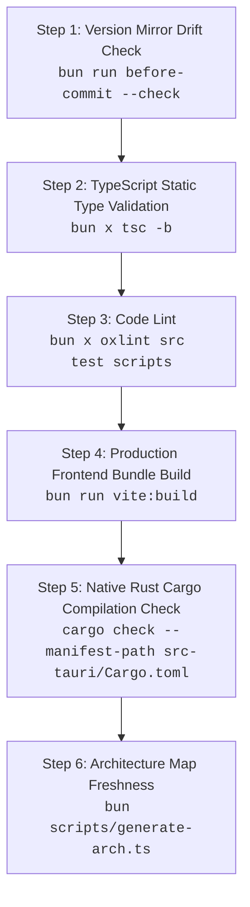

# Testing & Quality Assurance Guide

This document defines the testing strategy, automated quality gates, and manual verification procedures for **Minimalistic App**.

---

## ⚡ Quick Testing Commands

```bash
# 1. Primary test command (Runs full 6-step pre-commit validation suite)
bun test
# or
bun run validate

# 2. Static TypeScript Type Checking (tsc -b)
bun run typecheck

# 3. Code Lint (oxlint — TS7-compatible)
bun run lint
bun run lint:fix   # auto-fix variant

# 4. Code Formatting Verification (Prettier + cargo fmt)
bun run format:check

# 5. Version Synchronization Validation (Mirror drift check)
bun run before-commit --check

# 6. Live Development & Interactive Testing
bun run tauri dev
```

---

## 🛡️ The 6-Step Pre-Commit Quality Gate (`bun run validate`)

The automated validation pipeline executes 6 strict quality gates sequentially in ~2–3 seconds:



1. **Version Sync Gate**: Ensures `package.json`, `src-tauri/Cargo.toml`, and `src-tauri/tauri.conf.json` exactly match `APP_VERSION` in `scripts/version.ts`.
2. **TypeScript Type Gate**: Runs `tsc -b` with strict null checks, `noUnusedLocals`, and `verbatimModuleSyntax`.
3. **Code Lint Gate**: Runs oxlint (TS7-compatible) with correctness/suspicious/perf categories plus React, unicorn, and import plugin rules.
4. **Vite Production Build Gate**: Compiles the production frontend bundle into `dist/` to catch bundler, CSS token, or asset resolution issues.
5. **Rust Cargo Compilation Gate**: Verifies backend compilation against Tauri v2 and OS APIs.
6. **Architecture Map Gate**: Automatically refreshes `ARCHITECTURE.md` with accurate file metrics and directory trees.

---

## 🌐 Browser Dev Preview Testing (`bun run vite`)

To test UI components, responsive layout, animations, and ARIA keyboard navigation without compiling the Rust backend:

```bash
bun run vite
```

### Web Preview Expectations:

- The top header badge renders **"Web Preview"** (amber indicator).
- Tauri-only features (e.g. autostart, minimize-to-tray IPC) gracefully fall back to web-safe defaults without unhandled errors.
- "Copy Diagnostics" copies fallback web runtime diagnostic information.

---

## 🖥️ Desktop Native Manual QA Matrix (`bun run tauri dev`)

Run through this test matrix when testing native desktop features:

| Feature Area                 | Action / Test Step                                          | Expected Behavior                                                                             |
| :--------------------------- | :---------------------------------------------------------- | :-------------------------------------------------------------------------------------------- |
| **Tray Left-Click**          | Left-click the taskbar / system tray icon.                  | Toggles GUI window visibility (hides if open, shows & focuses if hidden).                     |
| **Tray Context Menu**        | Right-click the tray icon.                                  | Opens native menu with: `Open / Hide GUI`, `Check for Updates...`, `Quit`.                    |
| **Tray "Open / Hide GUI"**   | Click "Open / Hide GUI" in context menu.                    | Toggles window visibility identically to left-click.                                          |
| **Tray "Check for Updates"** | Click "Check for Updates..." with window hidden.            | Surfaces and focuses the main window and triggers the update checker.                         |
| **Close Button (Default)**   | Click window close button (X) with "Minimize on close" OFF. | The application process terminates cleanly and tray icon disappears.                          |
| **Minimize to Tray Toggle**  | Enable "Minimize to taskbar on close" in Preferences.       | Setting persists to `%APPDATA%/com.minimalistic.app/settings.json`.                           |
| **Close Button (Minimized)** | Click window close button (X) with "Minimize on close" ON.  | Window hides to system tray; process remains active.                                          |
| **Autostart Toggle**         | Toggle "Start application on system login".                 | Toggles OS autostart registration via `@tauri-apps/plugin-autostart`.                         |
| **Copy Diagnostics**         | Click "Copy Diagnostics" in System & About tab.             | Copies formatted markdown diagnostics to clipboard; button displays green checkmark feedback. |
| **Keyboard Navigation**      | Use `Tab`, `ArrowLeft`/`ArrowRight`, `Space`, `Enter`.      | Full roving tab focus across tabs and switches; Space/Enter toggles switches.                 |
| **Tray "Quit"**              | Click "Quit" from the tray context menu.                    | Sets `is_quitting = true` and performs graceful Win32 window class teardown without errors.   |
